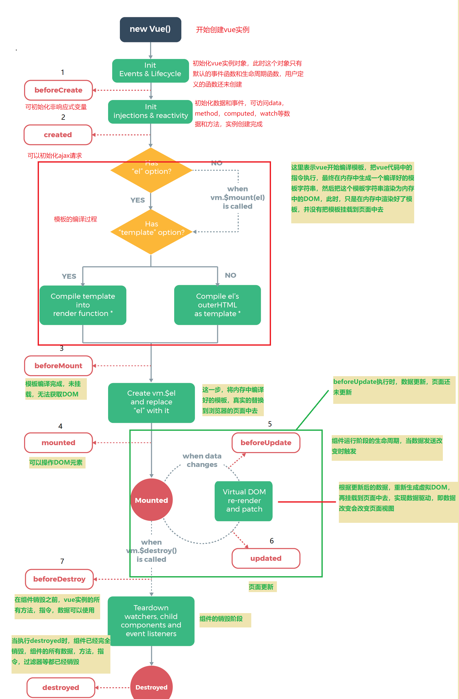
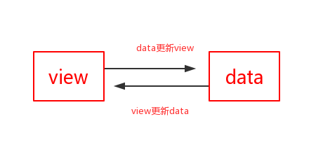

# vue学习笔记

## 1 对于MVVM和MVC的区别和理解

### 1.1 MVVM

MVVM 是 Model-View-ViewModel 的缩写。
**Model**代表数据模型，负责存储数据
**View** 代表UI 组件，从ViewModel层获取数据，然后显示。
**ViewModel** 监听模型数据的改变和控制视图行为，处理用户交互，简单理解就是一个同步View 和 Model的对象，连接Model和View。封装业务逻辑处理，封装网络处理，封装数据缓存，就是把原来ViewController层的业务逻辑和页面逻辑等剥离出来放到ViewModel层。


在MVVM架构下，View 和 Model 之间并没有直接的联系，而是通过ViewModel进行交互，Model 和 ViewModel 之间的交互是双向的， 因此View 数据的变化会同步到Model中，而Model 数据的变化也会立即反应到View 上。
**ViewModel** 通过双向数据绑定把 View 层和 Model 层连接了起来，而View 和 Model 之间的同步工作完全是自动的，无需人为干涉，因此开发者只需关注业务逻辑，不需要手动操作DOM, 不需要关注数据状态的同步问题，复杂的数据状态维护完全由 MVVM 来统一管理

### 1.2 MVC

MVC 即 Model-View-Controller 的缩写，就是 **模型-视图-控制器** , 也就是说一个标准的Web 应用程式是由这三部分组成的。

MVC 即 Model-View-Controller 的缩写，就是 **模型-视图-控制器** , 也就是说一个标准的Web 应用程序是由这三部分组成的：  

> **View** 用来把数据以某种方式呈现给用户。
>
> **Model** 其实就是数据。
>
> **Controller** 接收并处理来自用户的请求，并将 Model 返回给用户。

在HTML5 还未火起来的那些年，MVC 作为Web 应用的最佳实践是OK 的，这是因为 Web 应用的View 层相对来说比较简单，前端所需要的数据在后端基本上都可以处理好，View 层主要是做一下展示，那时候提倡的是 Controller 来处理复杂的业务逻辑，所以View 层相对来说比较轻量，就是所谓的**瘦客户端**思想。

2010年到2011年，HTML5概念被热炒，受到追捧，2012年，W3C 正式宣布HTML5规范已经正式定稿。2013年我刚进公司就接触了第一个 HTML5 框架 **Sench touch**, 它是一款用来构建移动应用的HTML5 框架，它将前后端彻底分离，前端采用MVC 架构，作为一个独立的项目工程来维护。

### 1.3 前端为什么要工程化，要使用 MVC

相对 HTML4 , HTML5 最大的亮点是**它为移动设备提供了一些非常有用的功能**，使得 HTML5 具备了开发App的能力, HTML5开发App 最大的好处就是**跨平台、快速迭代和上线，节省人力成本和提高效率**，因此很多企业开始对传统的App进行改造，逐渐用H5代替Native，到2015年的时候，市面上大多数App 或多或少嵌入都了H5 的页面。

既然要用H5 来构建 App, 那View 层所做的事，就不仅仅是简单的数据展示了，它不仅要管理复杂的数据状态，还要处理移动设备上各种操作行为等等。因此，前端也需要工程化，也需要一个类似于MVC 的框架来管理这些复杂的逻辑，使开发更加高效。 但这里的 MVC 又稍微发了点变化：

> **View** UI布局，展示数据。
>
> **Model** 管理数据。
>
> **Controller** 响应用户操作，并将 Model 更新到 View 上。

这种 MVC 架构模式对于简单的应用来看起是OK 的，也符合软件架构的分层思想。 但实际上，随着H5 的不断发展，人们更希望使用H5 开发的应用能和Native 媲美，或者接近于原生App 的体验效果，于是前端应用的复杂程度已不同往日，今非昔比。这时前端开发就暴露出了三个痛点问题：

- 开发者在代码中大量调用相同的 DOM API, 处理繁琐 ，操作冗余，使得代码难以维护。
- 大量的DOM 操作使页面渲染性能降低，加载速度变慢，影响用户体验。
- 当 Model 频繁发生变化，开发者需要主动更新到View ；当用户的操作导致 Model 发生变化，开发者同样需要将变化的数据同步到Model 中，这样的工作不仅繁琐，而且很难维护复杂多变的数据状态。

其实，早期jquery 的出现就是为了前端能更简洁的操作DOM 而设计的，但它只解决了第一个问题，另外两个问题始终伴随着前端一直存在。

### 1.4 MVVM 解决问题

MVVM 由 Model,View,ViewModel 三部分构成，Model 层代表数据模型，也可以在Model中定义数据修改和操作的业务逻辑；View 代表UI 组件，它负责将数据模型转化成UI 展现出来，ViewModel 是一个同步View 和 Model的对象。

在MVVM架构下，View 和 Model 之间并没有直接的联系，而是通过ViewModel进行交互，Model 和 ViewModel 之间的交互是双向的， 因此View 数据的变化会同步到Model中，而Model 数据的变化也会立即反应到View 上。

ViewModel 通过双向数据绑定把 View 层和 Model 层连接了起来，而View 和 Model 之间的同步工作完全是自动的，无需人为干涉，因此开发者只需关注业务逻辑，不需要手动操作DOM, 不需要关注数据状态的同步问题，复杂的数据状态维护完全由 MVVM 来统一管理。


## 2 vue生命周期

​	每个Vue实例在被创建之前都要经过一系列的初始化过程,也就是从开始创建、初始化数据、编译模板、挂载Dom、渲染→更新→渲染、销毁等一系列过程，这个过程就是vue的生命周期。 

### 1.1 生命周期阶段

```

```

###1.2 生命周期钩子函数

生命周期钩子函数的作用是在vue生命周期不同阶段进行操作，vue2.0提供的钩子函数共有11个，如下：

生命周期钩子函数分类

1. 创建期间
   * beforeCreate
   * created
   * beforeMount
   * mounted
2. 运行期间
   * beforeupdate
   * updated
3. 销毁期间
   * beforeDestroy
   * destroyed

| 生命周期钩子  |                           组件状态                           |                            用途                             |
| :-----------: | :----------------------------------------------------------: | :---------------------------------------------------------: |
| beforeCreate  | 实例初始化之后，this指向创建的实例，不能访问到data、computed、watch、methods上的方法和数据 |                  常用于初始化非响应式变量:                  |
|    created    | 实例创建完成，可访问data、computed、watch、methods上的方法和数据，未挂载到DOM，不能访问到$el属性，$ref属性内容为空数组 |             常用于简单的ajax请求，页面的初始化              |
|  beforeMount  | 在挂载开始之前被调用，beforeMount之前，会找到对应的template，并编译成render函数，还未挂载DOM |                                                             |
|    mounted    | 实例挂载到DOM上，此时可以通过DOM API获取到DOM节点，$ref属性可以访问，此时vue实例对象创建完成 |             常用于获取VNode信息和操作，ajax请求             |
| beforeupdate  |              响应式数据更新时调用，页面尚未更新              | 适合在更新之前访问现有的DOM，比如手动移除已添加的事件监听器 |
|    updated    | 虚拟 DOM 重新渲染和打补丁之后调用，组件DOM已经更新，可执行依赖于DOM的操作 |        避免在这个钩子函数中操作数据，可能陷入死循环         |
| beforeDestroy | 实例销毁之前调用。这一步，实例仍然完全可用，this仍能获取到实例 |     常用于销毁定时器、解绑全局事件、销毁插件对象等操作      |
|   destroyed   | 实例销毁后调用，调用后，Vue 实例指示的所有东西都会解绑定，所有的事件监听器会被移除，所有的子实例也会被销毁 |                                                             |
|   activated   | keep-alive 组件激活时调用，该钩子在服务器端渲染期间不被调用  |                                                             |
|  deactivated  | keep-alive 组件停用时调用 ， 该钩子在服务器端渲染期间不被调用 |                                                             |
| errorCaptured | 当捕获一个来自子孙组件的错误时被调用。此钩子会收到三个参数：错误对象、发生错误的组件实例以及一个包含错误来源信息的字符串。此钩子可以返回 false 以阻止该错误继续向上传播 |                                                             |

**注意**:

1. created阶段的ajax请求与mounted请求的区别：前者页面视图未出现，如果请求信息过多，页面会长时间处于白屏状态
2. `mounted` 不会承诺所有的子组件也都一起被挂载。如果你希望等到整个视图都渲染完毕，可以用 vm.$nextTick
3. vue2.0之后主动调用$destroy()不会移除dom节点，作者不推荐直接destroy这种做法，如果实在需要这样用可以在这个生命周期钩子中手动移除dom节点

### 1.3 生命周期探究

1. 实例、组件通过new Vue() 创建出来之后会初始化事件和生命周期，然后就会执行beforeCreate钩子函数，这个时候，数据还没有挂载呢，只是一个空壳，无法访问到数据和真实的dom，一般不做操作；
2. 挂载数据，绑定事件等等，然后执行created函数，这个时候已经可以使用到数据，也可以更改数据,在这里更改数据不会触发updated函数，在这里可以在渲染前倒数第二次更改数据的机会，不会触发其他的钩子函数，一般可以在这里做初始数据的获取；
3. 接下来开始找实例或者组件对应的模板，编译模板为虚拟dom放入到render函数中准备渲染，然后执行beforeMount钩子函数，在这个函数中虚拟dom已经创建完成，马上就要渲染,在这里也可以更改数据，不会触发updated，在这里可以在渲染前最后一次更改数据的机会，不会触发其他的钩子函数，一般可以在这里做初始数据的获取；
4. 接下来开始render，渲染出真实dom，然后执行mounted钩子函数，此时，组件已经出现在页面中，数据、真实dom都已经处理好了,事件都已经挂载好了，可以在这里操作真实dom等事情...
5. 当组件或实例的数据更改之后，会立即执行beforeUpdate，然后vue的虚拟dom机制会重新构建虚拟dom与上一次的虚拟dom树利用diff算法进行对比之后重新渲染，一般不做什么事儿；
6. 当更新完成后，执行updated，数据已经更改完成，dom也重新render完成，可以操作更新后的虚拟dom；
7. 当经过某种途径调用$destroy方法后，立即执行beforeDestroy，一般在这里做一些善后工作，例如清除计时器、清除非指令绑定的事件等等；
8. 组件的数据绑定、监听...去掉后只剩下dom空壳，这个时候，执行destroyed，在这里做善后工作也可以。

**代码演示**

```html
<!DOCTYPE html>
<html>
<head>
    <title></title>
    <script type="text/javascript" src="https://cdn.jsdelivr.net/vue/2.1.3/vue.js"></script>
</head>
<body>
 
<div id="app">
     <p>{{ message }}</p>
</div>
 
<script type="text/javascript">
    
  var app = new Vue({
      el: '#app',
      data: {
          message : "laonan is oldman" 
      },
       beforeCreate: function () {
                console.group('beforeCreate 创建前状态===============》');
               console.log("%c%s", "color:red" , "el     : " + this.$el); //undefined
               console.log("%c%s", "color:red","data   : " + this.$data); //undefined 
               console.log("%c%s", "color:red","message: " + this.message)  
        },
        created: function () {
            console.group('created 创建完毕状态===============》');
            console.log("%c%s", "color:red","el     : " + this.$el); //undefined
               console.log("%c%s", "color:red","data   : " + this.$data); //已被初始化 
               console.log("%c%s", "color:red","message: " + this.message); //已被初始化
        },
        beforeMount: function () {
            console.group('beforeMount 挂载前状态===============》');
            console.log("%c%s", "color:red","el     : " + (this.$el)); //已被初始化
            console.log(this.$el);
               console.log("%c%s", "color:red","data   : " + this.$data); //已被初始化  
               console.log("%c%s", "color:red","message: " + this.message); //已被初始化  
        },
        mounted: function () {
            console.group('mounted 挂载结束状态===============》');
            console.log("%c%s", "color:red","el     : " + this.$el); //已被初始化
            console.log(this.$el);    
               console.log("%c%s", "color:red","data   : " + this.$data); //已被初始化
               console.log("%c%s", "color:red","message: " + this.message); //已被初始化 
        },
        beforeUpdate: function () {
            console.group('beforeUpdate 更新前状态===============》');
            console.log("%c%s", "color:red","el     : " + this.$el);
            console.log(this.$el);   
               console.log("%c%s", "color:red","data   : " + this.$data); 
               console.log("%c%s", "color:red","message: " + this.message); 
        },
        updated: function () {
            console.group('updated 更新完成状态===============》');
            console.log("%c%s", "color:red","el     : " + this.$el);
            console.log(this.$el); 
               console.log("%c%s", "color:red","data   : " + this.$data); 
               console.log("%c%s", "color:red","message: " + this.message); 
        },
        beforeDestroy: function () {
            console.group('beforeDestroy 销毁前状态===============》');
            console.log("%c%s", "color:red","el     : " + this.$el);
            console.log(this.$el);    
               console.log("%c%s", "color:red","data   : " + this.$data); 
               console.log("%c%s", "color:red","message: " + this.message); 
        },
        destroyed: function () {
            console.group('destroyed 销毁完成状态===============》');
            console.log("%c%s", "color:red","el     : " + this.$el);
            console.log(this.$el);  
               console.log("%c%s", "color:red","data   : " + this.$data); 
               console.log("%c%s", "color:red","message: " + this.message)
        }
    })
</script>
</body>
</html> 
```

## 3 virtual DOM

### 1 浏览器的渲染机制

今天的主题是研究DOM和虚拟DOM之间的关系，在介绍虚拟DOM之前，先复习一下浏览器渲染机制，了解浏览器是如何处理原生DOM，从用户发起请求，浏览器根据URL发送请求，服务器响应并正常返回数据之后，浏览器首先

**①.**处理 HTML 并构建 DOM 树；

**②.**处理 CSS 构建 CSSOM 树；

**③**.将 DOM 与 CSSOM 合并成一个渲染树；

**④.**根据渲染树来布局，计算每个节点的位置；

**⑤.**调用 GPU 绘制，合成图层，显示在屏幕上。


在渲染过程中，在构建 CSSOM 树的时候会阻塞渲染，直至 CSSOM 树构建完成。并且构建 CSSOM 树是一个十分消耗性能的过程，所以应该尽量保证层级扁平，减少过度层叠，越是具体的 CSS 选择器，执行速度越慢。

当 HTML 解析到 script 标签时，会暂停构建 DOM，直到 script 里的内容解析完成后才会从暂停的地方重新开始。也就是说，如果你想首屏渲染的越快，就越不应该在首屏就加载 JS 文件（当然你可以使用异步加载）。并且CSS 也会影响 JS 的执行，只有当解析完样式表才会执行 JS，所以也可以认为这种情况下，CSS 也会暂停构建DOM。从浏览器最基础的DOM渲染过程我们可以了解到原生DOM渲染是十分消耗性能的一种操作，同时也表明了在大型项目中使用更高效渲染方式的必要性，比较流行的前端 JS 框架也渐渐使用了 虚拟DOM这一手段。

### 2 virtual dom

当我们改变DOM或者操作DOM的时候，浏览器会重新跑一遍渲染流程，重点就是创建渲染树的时候，需要重新计算所有样式以及对应render对象的视觉属性，当然对于单页面来说，这也许并没有什么影响，但是对于成百上千页面的时候，一次DOM操作，将会引起大量的计算，让整个流程的性能严重降低。 

但是当使用Virtual DOM的时候，对于DOM操作引起的计算会大幅度减少，提高整个系统的性能


当第一遍渲染页面后，render（）方法在渲染一个页面的同时会返回一个Virtual DOM Tree，当然目前这个和实际的DOM Tree是一样的，但是当我们操作DOM或者改变DOM的时候，会生成一个新的Virtual DOM Tree，然后调用VUE2.0中新增加的diff算法，这个算法的关键就是对比两个DOM Tree，并且记录下来差异（patches）,然后通过patch(）函数，找到最小的代价来修改真实的DOM Tree。当然你也可以理解为diff算法就是调用patch函数像打补丁一样去给真实的DOM Tree去缝补。

### 3 优势

- 虚拟DOM不会进行造成排版与重绘操作；
- 虚拟DOM进行频繁修改，然后一次性比较并修改真实DOM中需要改的部分（DIFF算法），最后并在真实DOM中进行排版与重绘，减少过多DOM节点排版与重绘损耗；
- 真实DOM频繁排版与重绘的效率是相当低的；
- 虚拟DOM有效降低大面积（真实DOM节点）的重绘与排版，因为最终与真实DOM比较差异，可以只渲染局部使用虚拟DOM的损耗计算；

总损耗 = 虚拟DOM增删改 + （与Diff算法效率有关）真实DOM差异增删改 + （较少的节点）排版与重绘

### 4 实现

* dom tree
* DIFF算法
* patch()

## 4 双向绑定原理

所谓MVVM数据双向绑定，即主要是：数据变化更新视图，视图变化更新数据。如下图：

```

```

也就是说：

- 输入框内容变化时，data 中的数据同步变化。即 view => model 的变化。
- data 中的数据变化时，文本节点的内容同步变化。即 model => view 的变化。

要实现这两个过程，关键点在于数据变化如何更新视图，因为视图变化更新数据我们可以通过事件监听的方式来实现。所以我们着重讨论数据变化如何更新视图。

数据变化更新视图的关键点则在于我们如何知道数据发生了变化，只要知道数据在什么时候变了，那么问题就变得迎刃而解，我们只需在数据变化的时候去通知视图更新即可

### 4.1 基本原理

Vue.js 是采用 Object.defineProperty 的 getter 和 setter，并结合观察者模式来实现数据绑定的。当把一个普通 Javascript 对象传给 Vue 实例来作为它的 data 选项时，Vue 将遍历它的属性，用 Object.defineProperty 将它们转为 getter/setter。用户看不到 getter/setter，但是在内部它们让 Vue 追踪依赖，在属性被访问和修改时通知变化。


*  **Observer** 数据监听器，能够对数据对象的所有属性进行监听，如有变动可拿到最新值并通知订阅者，内部采用Object.defineProperty的getter和setter来实现。
* **compile**主要做的事情是解析模板指令，将模板中的变量替换成数据，然后初始化渲染页面视图，并将每个指令对应的节点绑定更新函数，添加监听数据的订阅者，一旦数据有变动，收到通知，更新视图Compile 指令解析器，它的作用对每个元素节点的指令进行扫描和解析，根据指令模板替换数据，以及绑定相应的更新函数。
* **Watcher**订阅者作为Observer和Compile之间通信的桥梁，主要做的事情是:
  1、在自身实例化时往属性订阅器(dep)里面添加自己
  2、自身必须有一个update()方法
  3、待属性变动dep.notice()通知时，能调用自身的update()方法，并触发Compile中绑定的回调，则功成身退。
* **Dep**消息订阅器，内部维护了一个数组，用来收集订阅者（Watcher），数据变动触发notify 函数，再调用订阅者的 update 方法。

从图中可以看出，当执行 new Vue() 时，Vue 就进入了初始化阶段，一方面Vue 会遍历 data 选项中的属性，并用 Object.defineProperty 将它们转为 getter/setter，实现数据变化监听功能；另一方面，Vue 的指令编译器Compile 对元素节点的指令进行扫描和解析，初始化视图，并订阅Watcher 来更新视图， 此时Wather 会将自己添加到消息订阅器中(Dep),初始化完毕。

当数据发生变化时，Observer 中的 setter 方法被触发，setter 会立即调用Dep.notify()，Dep 开始遍历所有的订阅者，并调用订阅者的 update 方法，订阅者收到通知后对视图进行相应的更新

### 4.2  Object.defineProperty()

Object.defineProperty() 方法会直接在一个对象上定义一个新属性，或者修改一个对象的现有属性， 并返回这个对象。

语法：Object.defineProperty(obj, prop, descriptor)

```javascript
obj//要在其上定义属性的对象。
prop//要定义或修改的属性的名称。
descriptor//将被定义或修改的属性描述符。
```

### 4.3 js实现

详情：<https://www.cnblogs.com/wangjiachen666/p/9883916.html>

```
<html lang="en">
<head>
    <meta charset="UTF-8">
    <title>Document</title>
</head>
<body>
    <h1 id="name"></h1>
    <input type="text">
    <input type="button" value="改变data内容" onclick="changeInput()">
    
<script src="observer.js"></script>
<script src="watcher.js"></script>
<script>
    function myVue (data, el, exp) {
        this.data = data;
        observable(data);                      //将数据变的可观测
        el.innerHTML = this.data[exp];           // 初始化模板数据的值
        new Watcher(this, exp, function (value) {
            el.innerHTML = value;
        });
        return this;
    }

    var ele = document.querySelector('#name');
    var input = document.querySelector('input');
    
    var myVue = new myVue({
        name: 'hello world'
    }, ele, 'name');
    
    //改变输入框内容
    input.oninput = function (e) {
        myVue.data.name = e.target.value
    }
    //改变data内容
    function changeInput(){
        myVue.data.name = "难凉热血"
    
    }
</script>
</body>
</html>
```

observer.js

```
    /**
     * 把一个对象的每一项都转化成可观测对象
     * @param { Object } obj 对象
     */
    function observable (obj) {
        if (!obj || typeof obj !== 'object') {
            return;
        }
        let keys = Object.keys(obj);
        keys.forEach((key) =>{
            defineReactive(obj,key,obj[key])
        })
        return obj;
    }
    /**
     * 使一个对象转化成可观测对象
     * @param { Object } obj 对象
     * @param { String } key 对象的key
     * @param { Any } val 对象的某个key的值
     */
    function defineReactive (obj,key,val) {
        let dep = new Dep();
        Object.defineProperty(obj, key, {
            get(){
                dep.depend();
                console.log(`${key}属性被读取了`);
                return val;
            },
            set(newVal){
                val = newVal;
                console.log(`${key}属性被修改了`);
                dep.notify()                    //数据变化通知所有订阅者
            }
        })
    }
    class Dep {
        
        constructor(){
            this.subs = []
        }
        //增加订阅者
        addSub(sub){
            this.subs.push(sub);
        }
        //判断是否增加订阅者
        depend () {
            if (Dep.target) {
                this.addSub(Dep.target)
            }
        }

        //通知订阅者更新
        notify(){
            this.subs.forEach((sub) =>{
                sub.update()
            })
        }
        
    }
    Dep.target = null;
```

watcher.js

```
    class Watcher {
        constructor(vm,exp,cb){
            this.vm = vm;
            this.exp = exp;
            this.cb = cb;
            this.value = this.get();  // 将自己添加到订阅器的操作
        }
        get(){
            Dep.target = this;  // 缓存自己
            let value = this.vm.data[this.exp]  // 强制执行监听器里的get函数
            Dep.target = null;  // 释放自己
            return value;
        }
        update(){
            let value = this.vm.data[this.exp];
            let oldVal = this.value;
            if (value !== oldVal) {
                this.value = value;
                this.cb.call(this.vm, value, oldVal);
            }
    }
}
```

### 4.4 3.0vue实现原理

<https://juejin.im/post/5acd0c8a6fb9a028da7cdfaf#heading-9>

## 5 react和vue对比

### 5.1相同点

1. 状态管理redux,vuex
2. 虚拟dom
3. 都是mvvm框架，数据驱动，不用操作dom
4. 

### 5.2不同点

**react**

1. react支持jsx语法，写代码灵活多变，all in js
2. 类式的写法，缺少api，缺少vue那样的v-if 、v-for的指令
3. 数据传递，父传子props，子传父采用回调函数
4. 不能直接修改state，采用setstate进行
5. 组件样式为全局样式，不同组件有相同样式名就会冲突

vue

1. 采用基于html的模板语法，写法更接近原生的

##  6 事件处理

### 监听事件

可以用v-on指令监听DOM事件，v-on可以简写为@。在Vue中主要采用内联方式来进行事件的绑定，就是在HTML文档中采用`v-on`指令来监听DOM事件，具体代码如下：

```html
<div id="example"> <button v-on:click="function"></button> </div>
```

为什么要进行事件监听？

1. 扫一眼 HTML 模板便能轻松定位在 JavaScript 代码里对应的方法。
2. 因为你无须在 JavaScript 里手动绑定事件，你的 ViewModel 代码可以是非常纯粹的逻辑，和 DOM 完全解耦，更易于测试。
3. 当一个 ViewModel 被销毁时，所有的事件处理器都会自动被删除。你无须担心如何清理它们。

### 事件处理方法

1. 直接绑定方法名

2. 在内联Javascript中调用方法

   例如：

   ```html
   <div id="example-3">
     <button v-on:click="say('hi')">Say hi</button>
     <button v-on:click="say('what')">Say what</button>
   </div>
   ```

   ```javascript
   new Vue({
     el: '#example-3',
     methods: {
       say: function (message) {
         alert(message)
       }
     }
   })
   ```

3. 访问原生的DOM事件

   有时也需要在内联语句处理器中访问原始的 DOM 事件。可以用特殊变量 `$event` 把它传入方法 

   ```html
   <button v-on:click="warn('Form cannot be submitted yet.', $event)">
     Submit
   </button>
   ```

   ```javascript
   methods: {
     warn: function (message, event) {
       // 现在我们可以访问原生事件对象
       if (event) event.preventDefault()
       alert(message)
     }
   }
   ```

   原始DOM事件：

   Event 对象代表事件的状态，比如事件在其中发生的元素、键盘按键的状态、鼠标的位置、鼠标按钮的状态。

   事件通常与函数结合使用，函数不会在事件发生前被执行。

   标准 Event 方法

   下面列出了 2 级 DOM 事件标准定义的方法。IE 的事件模型不支持这些方法：

   | 方法                                                         | 描述                                     |
   | ------------------------------------------------------------ | ---------------------------------------- |
   | [initEvent()](http://www.w3school.com.cn/jsref/event_initevent.asp) | 初始化新创建的 Event 对象的属性。        |
   | [preventDefault()](http://www.w3school.com.cn/jsref/event_preventdefault.asp) | 通知浏览器不要执行与事件关联的默认动作。 |
   | [stopPropagation()](http://www.w3school.com.cn/jsref/event_stoppropagation.asp) | 不再派发事件。                           |

   preventDefault()

   该方法将通知 Web 浏览器不要执行与事件关联的默认动作（如果存在这样的动作）。例如，如果 type 属性是 "submit"，在事件传播的任意阶段可以调用任意的事件句柄，通过调用该方法，可以阻止提交表单

   stopPropagation() 

   终止事件在传播过程的捕获、目标处理或起泡阶段进一步传播。调用该方法后，该节点上处理该事件的处理程序将被调用，事件不再被分派到其他节点。总结起来就是阻止事件捕获或者事件冒泡。**event对象还有其他的修饰符，如键盘按键的修饰符，可看vue官网**

### 事件修饰符

在事件处理程序中调用 `event.preventDefault()` 或 `event.stopPropagation()` 是非常常见的需求。尽管我们可以在方法中轻松实现这点，但更好的方式是：方法只有纯粹的数据逻辑，而不是去处理 DOM 事件细节 

- `.stop`  阻止事件冒泡
- `.prevent` 阻止事件的默认行为。我们都知道`<a></a>`标签的默认行为是网页的跳转，但是我们可以通过.prevent来禁止网页的跳转 
- `.capture` 即给元素添加一个监听器，当元素发生冒泡时，先触发带有该修饰符的元素。若有多个该修饰符，则由外而内触发。  
- `.self`  关于`.stop`和`.self`的区别。前者是防止时间冒泡，后者则是忽略了事件冒泡和事件捕获的影响。只有直接作用在该元素上的事件才会被调用 
- `.once` 要求函数只执行一次 
- `.passive` `.passive` 修饰符尤其能够提升移动端的性能。不要把 `.passive` 和 `.prevent` 一起使用，因为 `.prevent` 将会被忽略，同时浏览器可能会向你展示一个警告。请记住，`.passive` 会告诉浏览器你不想阻止事件的默认行为 。

```html
<!-- 阻止单击事件继续传播 -->
<a v-on:click.stop="doThis"></a>

<!-- 提交事件不再重载页面 -->
<form v-on:submit.prevent="onSubmit"></form>

<!-- 修饰符可以串联 -->
<a v-on:click.stop.prevent="doThat"></a>

<!-- 只有修饰符 -->
<form v-on:submit.prevent></form>

<!-- 添加事件监听器时使用事件捕获模式 -->
<!-- 即元素自身触发的事件先在此处理，然后才交由内部元素进行处理 -->
<div v-on:click.capture="doThis">...</div>

<!-- 只当在 event.target 是当前元素自身时触发处理函数 -->
<!-- 即事件不是从内部元素触发的 -->
<div v-on:click.self="doThat">...</div>
```

**代码测试 stop- prevent- self -capture**

```html
<!DOCTYPE html>
<html>
<head>
    <title></title>
    <script type="text/javascript" src="https://cdn.jsdelivr.net/vue/2.1.3/vue.js"></script>
</head>
<body>
 
<div id="demo" @click="A">
    <div @click="B">
      <div @click="C">点我看看</div>
    </div>
</div>
 
<script type="text/javascript">
    
  var app = new Vue({
      el: '#demo',
      methods:{
        A(){
          console.log("a")
        },
        B(){
          console.log("b")
        },
        C(){
          console.log("c")
        },
      }
    })
</script>
</body>
</html>
```

使用修饰符时，顺序很重要；相应的代码会以同样的顺序产生。因此，用 `v-on:click.prevent.self` 会阻止**所有的点击**，而 `v-on:click.self.prevent` 只会阻止对元素自身的点击。