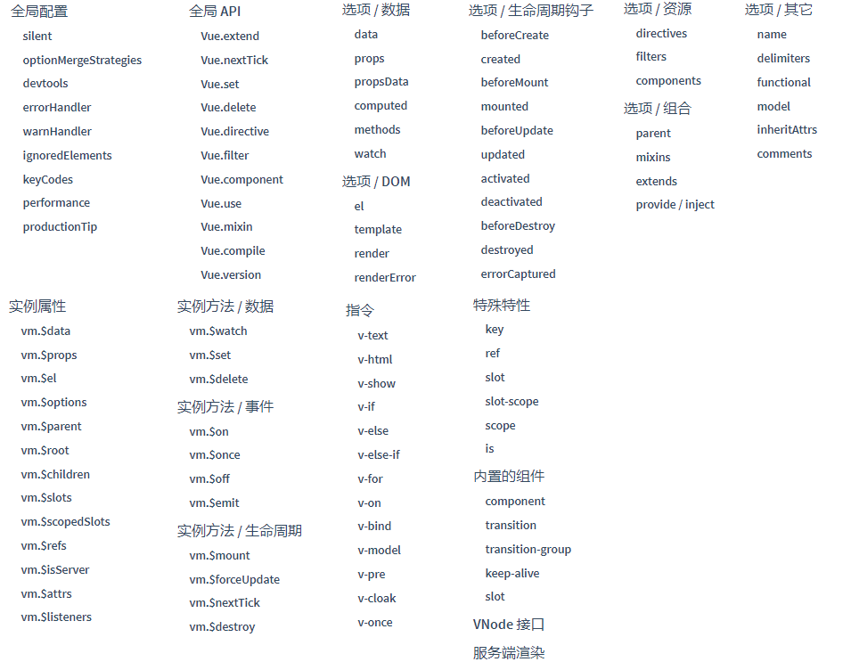

# vue基础

vue是一个mvvm框架，核心是数据驱动和组件化

## 1. Vue.js是什么

  **Vue.js**也称为Vue，读音/vju:/，类似view，错误读音v-u-e
  版本：v1.0 v2.0

- 是一个构建用户界面的框架
- 是一个轻量级MVVM（Model-View-ViewModel）框架，和angular、react类似，其实就是所谓的数据双向绑定
- 数据驱动+组件化的前端开发（核心思想）
- 通过简单的API实现**响应式的数据绑定**和**组合的视图组件**
- 更容易上手、小巧

## 2 vue扩展程序

谷歌浏览器安装vue-devtools,方便在浏览器中调试

在github搜索或者谷歌应用商店上下载

```javascript
//配置是否允许vue-devtools检查代码，方便调试，生产环境中需要设置为false
    Vue.config.devtools=false;
    Vue.config.productionTip=false; //阻止vue启动时生成生产消息
```

## 3 vue 指令

### 3.1 数据绑定----------v-model

实现数据的双向绑定功能，一般用于表单元素

#### 使用场景

### 3.2 列表渲染-----------v-for

### 3.3 事件绑定-----------v-on

* 事件对象-------$event
  包含事件相关信息，如事件源、事件类型、偏移量

* 事件冒泡--默认行为

  1. 原生js阻止事件冒泡--默认行为
     获取事件对象，调用原生js的e.stopPropagation()方法阻止事件冒泡
     调用 e.preventDefault()阻止事件的默认行为，例如点击事件的跳转
  2. vue阻止事件冒泡---默认行为
     不依赖与事件对象，采用修饰符
     .stop---阻止冒泡
     .prevent----阻止默认行为

  ```javascript
  <!DOCTYPE html>
  <html lang="en">
  <head>
  	<meta charset="UTF-8">
  	<title>事件冒泡和默认行为</title>
  	<script src="js/vue.js"></script>
  	<script>
  		window.onload=function(){
  			let vm=new Vue({
  				el:'#itany',
  				methods:{ 
  					show(){
  						console.log(111);
  						// e.stopPropagation();
  					},
  					print(){
  						console.log(222);
  					},
  					write(){
  						console.log(333);
  					},
  					study(){
  						console.log(444);
  						// e.preventDefault();
  					}
  				}
  			});
  		}
  	</script>
  </head>
  <body>
  	<div id="itany">
  		<div @click="write">
  			<p @click="print">
  				<!-- <button @click="show($event)">点我</button> -->
  				<button @click.stop="show">点我</button>
  			</p>
  		</div>
  		<hr>
  		<!-- <a href="#" @click="study($event)">俺是链接</a> -->
  		<a href="#" @click.prevent="study">俺是链接</a>
  	</div>
  </body>
  </html>
  ```

* 键盘事件
  回车：@keydown.13 或@keydown.enter
  上：@keydown.38 或@keydown.up

  默认没有@keydown.a/b/c...事件，可以自定义键盘事件，也称为自定义键码或自定义键位别名

  查看官网api全局配置keycode

* 事件修饰符
  once--只执行一次

### 3.4 条件渲染-----------v-if--v-show

#### v-if

#### v-show

### 3.5 属性绑定-----------v-bind

修饰符

- `.prop` - 被用于绑定 DOM 属性 (property)。([差别在哪里？](https://stackoverflow.com/questions/6003819/properties-and-attributes-in-html#answer-6004028))
- `.camel` - (2.1.0+) 将 kebab-case 特性名转换为 camelCase. (从 2.1.0 开始支持)
- `.sync` (2.3.0+) 语法糖，会扩展成一个更新父组件绑定值的 `v-on` 侦听器。

```javascript
<!-- 绑定一个属性 -->


<!-- 动态特性名 (2.6.0+) -->
<button v-bind:[key]="value"></button>

<!-- 缩写 -->


<!-- 动态特性名缩写 (2.6.0+) -->
<button :[key]="value"></button>

<!-- 内联字符串拼接 -->


<!-- class 绑定 -->
<div :class="{ red: isRed }"></div>
<div :class="[classA, classB]"></div>
<div :class="[classA, { classB: isB, classC: isC }]">

<!-- style 绑定 -->
<div :style="{ fontSize: size + 'px' }"></div>
<div :style="[styleObjectA, styleObjectB]"></div>

<!-- 绑定一个有属性的对象 -->
<div v-bind="{ id: someProp, 'other-attr': otherProp }"></div>

<!-- 通过 prop 修饰符绑定 DOM 属性 -->
<div v-bind:text-content.prop="text"></div>

<!-- prop 绑定。“prop”必须在 my-component 中声明。-->
<my-component :prop="someThing"></my-component>

<!-- 通过 $props 将父组件的 props 一起传给子组件 -->
<child-component v-bind="$props"></child-component>

<!-- XLink -->
<svg><a :xlink:special="foo"></a></svg>
```

### 3.6 v-cloak

### 3.7 v-text v-html

## 4 过滤器----filter

vue2.0没有内置过滤器，过滤器的作用是为了对数据格式化。

4.1 可以使用第三方的工具库，如loadash、date-fns

4.2 使用自定义过滤器

* 全局过滤器
  vue.filter

* 局部过滤器

## 5 计算属性---computed 

### 5.1基本用法

计算属性也是用来存储数据，但具有以下几个特点：

* 数据可以进行逻辑处理操作
* 对计算属性中的数据进行监视

```javascript
data:{ //普通属性
	msg:'welcome to itany',
	num1:8
	},
computed:{ //计算属性
	msg2:function(){ //该函数必须有返回值，用来获取属性，称为get函数
	return '欢迎来到南京网博';
	reverseMsg:function(){
		//可以包含逻辑处理操作，同时reverseMsg依赖于msg
		return this.msg.split(' ').reverse().join(' ');
		},
    },
//数据的调用
<h2>{{msg}}</h2>
<h2>{{msg2}}</h2>
<h2>{{reverseMsg}}</h2>
```

**data**和**computed**都可以用来存储数据，调用时的方式都相同。computed可以对数据进行逻辑操作并返回数据

computed使用时一般都是对data的数据进行一些逻辑处理，当data的数据发生变化时，computed会检测到数据的变化，会进行自动更新

### 5.2 computed和method

对于数据的逻辑处理，method方法也可以处理，两者的区别：

1. computed可以自动监听data数据的变化，对于数据的处理结果会缓存下来，当数据不发生变化的时候，computed不会执行，当数据发生变化，所有依赖这个数据的相关数据自动发生变化。method方法每调用一次就会执行一次

2. computed的初始化是在生命周期`beforeCreated`和`created`之间完成的

   method方法需要触发条件，例如点击事件触发

3. 对于需要多次使用的计算结果，采用计算属性，method重复调用会浪费资源

4. watch和computed：都是依赖数据发生改变的时候，被依赖的数据根据预先定义好的函数，发生自动的变化。不同之处：watch：善于处理一个数据影响多个数据。computed：一个数据受多个数据影响。

5. 数据变化的同时进行异步操作或者是性能比较大的开销，那么watch为最佳选择：需要进行缓存，而不是用methods，methods每次都调用会消耗较多的性能。

### 5.3 set和get

计算属性由两部分组成：get和set，分别用来获取计算属性和设置计算属性
默认只有get，如果需要set，要自己添加

```javascript
num2:{
	get:function(){
	console.log('num2：'+new Date());
	return this.num1-1;
	},
	set:function(val){
	// console.log('修改num2值');
	// this.num2=val;
	this.num1=111;
	}
	}
```

想要改变computed的计算属性，可以通过设置set，set函数不是直接改变计算属性的值，而是改变计算属性的依赖的数据。

## 6 vue实例属性和方法

### 6.1 $el

获取vue实例关联的元素
就是获取el挂载的dom的对象

```javascript
<div id="ha">   
</div>

var vm=new Vue({
    el:'#ha'
})
console.log(vm.$el)//div对象
```

### 6.2 $data

获取data对象

```javascript
//组件中的写法
data：function(){
    return {
		detailShow:false//具体数据
	}
}
//简写如下
data() {
	return {
		detailShow:false//具体数据
	}
},
```

Vue 实例的数据对象。Vue 将会递归将 data 的属性转换为 getter/setter，从而让 data 的属性能够响应数据变化。对象必须是纯粹的对象 (含有零个或多个的 key/value 对)：浏览器 API 创建的原生对象，原型上的属性会被忽略。大概来说，data 应该只能是数据 - 不推荐观察拥有状态行为的对象。

一旦观察过，不需要再次在数据对象上添加响应式属性。因此推荐在创建实例之前，就声明所有的根级响应式属性。

实例创建之后，可以通过 `vm.$data` 访问原始数据对象。Vue 实例也代理了 data 对象上所有的属性，因此访问 `vm.a` 等价于访问 `vm.$data.a`。

以 `_` 或 `$` 开头的属性 不会 被 Vue 实例代理，因为它们可能和 Vue 内置的属性、API 方法冲突。你可以使用例如 `vm.$data._property` 的方式访问这些属性。

当一个组件被定义，`data` 必须声明为返回一个初始数据对象的函数，因为组件可能被用来创建多个实例。如果 `data` 仍然是一个纯粹的对象，则所有的实例将共享引用同一个数据对象！通过提供 `data` 函数，每次创建一个新实例后，我们能够调用 `data` 函数，从而返回初始数据的一个全新副本数据对象。

### 6.3 $options

获取自定义属性、方法

```javascript
var vm=new Vue({
			el:'#itany',
			data:{
				msg:'welcome to itany'
			},
			name:'tom',
			age:24,
			show:function(){
				console.log('show');
			}
		});
//自定义属性name age show
console.log(vm.$options.name);
console.log(vm.$options.age);
vm.$options.show();
```

### 6.4 $ref

可以绑定组件或者dom元素，可以获取到组件和dom元素

### 6.5 $mount()

手动挂载vue实例

### 6.6 $destroy()

完全销毁一个实例

### 6.7 $nextTick()

vm.$nextTick(callback) 在DOM更新完成后再执行回调函数，一般在修改数据之后使用该方法，以便获取更新后的DOM

### 6.8` $set`和 `$delete`

动态的为vue实例添加属性，常规方法添加的属性vue监测不到

动态为vue实例删除属性

```javascript
	<script>
		var vm=new Vue({
			el:'#itany',
			data:{
				user:{
					id:1001,
					name:'tom'
				}
			},
			methods:{
				doUpdate(){
					this.user.name='汤姆'
				},
				doAdd(){
					// this.user.age=25; //通过普通方式为对象添加属性时vue无法实时监视到
					// this.$set(this.user,'age',18); //通过vue实例的$set方法为对象添加属性，可以实时监视
					// Vue.set(this.user,'age',22);
					if(this.user.age){
						this.user.age++;
					}else{
						Vue.set(this.user,'age',1);
					}

					// console.log(this.user);
				},
				doDelete(){
					if(this.user.age){
						// delete this.user.age; //无效
						Vue.delete(this.user,'age');
					}
				}
			}
		});
	</script>
```

### 6.9 $watch

用来监测vue实例 数据的变化

和vue属性watch一样的功能

对数据的监测有两种：

* 对基本数据类型进行监测
* 对引用类型监测（对象）

```javascript
var vm=new Vue({
	el:'#itany',
	data:{
		name:'tom',
		age:23,
		user:{
			id:1001,
			name:'alice'
		}
	},
	watch:{ //方式2：使用vue实例提供的watch选项
		age:(newValue,oldValue) => {
		console.log('age被修改啦，原值：'+oldValue+'，新值：'+newValue);
		},
        //对对象监视，需要使用handler和deep
		user:{
			handler:(newValue,oldValue) => {
			console.log('user被修改啦，原值：'+oldValue.name+'，新值：'+newValue.name);
			},
			deep:true //深度监视，当对象中的属性发生变化时也会监视
			}
		}
});

		//方式1：使用vue实例提供的$watch()方法
		vm.$watch('name',function(newValue,oldValue){
			console.log('name被修改啦，原值：'+oldValue+'，新值：'+newValue);
		});

	</script>
```

### 6.10  $isServer

判断哪些在服务端渲染，哪些在客户端渲染

### 6.11 $ emit


## 7 自定义指令

### 7.1 自定义全局指令

使用全局方法Vue.directive(指令ID,定义对象)   

### 7.2 自定义局部指令

## 8 过渡效果

vue含有内置的组件，其中transition组件是实现元素的过渡效果

### 8.1 基本用法

在transition组件中写过渡效果

```
<transiton name="ha">
	内容
</transition>

<style>
	.ha-enter-active{
        
	}
	.he-leave-active{
        
	}
	.ha-enter{
        
	}

</style>
```


### 8.2 钩子函数

### 8.3 使用第三方库----animate.css

### 8.4 多元素动画

多个元素的动画

```
<transition-group enter-active-class="animated bounceInLeft" leave-active-class="animated bounceOutRight">
			<p v-for="(v,k) in arr2" :key="k" v-show="flag">
				{{v}}
			</p>
</transition-group>
```

多个元素的动画需要使用内置组件`<transition-group></transition-group>`,同时必须为每个元素指定唯一的key值

##  9 前端路由

### 9.1 基本用法

1. 引入路由模块
2. 全局注册
3. 编写路由实例
4. 引入相应组件
5. vue实例挂载路由实例

```javascript
import Vue from 'vue';
import Router from 'vue-router';//1 引入vue-router模块
// 4 引入对应的vue组件，@表示的是src文件路径
import Goods from '@/components/goods/goods.vue';
import Ratings from '@/components/ratings/ratings.vue';
import Seller from '@/components/seller/seller.vue';


Vue.use(Router)//2 注册vue-router
//3 创建路由对象并配置路由规则
export default new Router({
  //去掉路由地址的#
  mode:'history',
  routes: [
    // {
    //   path: '/',//到时候地址栏会显示的路径
    //   name: 'header',//感觉有没有没啥影响
    //   component: Header// Header是组件的名字，这个路由对应跳转到的组件。注意component没有加“s”.
    // },
    { path:'/',redirect:'/goods'},//路径    重定向（路径） 具体路径
    { path:'/goods',name:'goods',component:Goods},//注意这个path，指的不是文件的路径，指的是地址栏会出现的地址
    { path:'/ratings',name:'ratings',component:Ratings},
    { path:'/seller',name:'seller',component:Seller}
  ],
  linkActiveClass:'active',
  linkExactActiveClass:'active'
})
```

* 在组件内，通过router-link标签进行跳转，默认渲染成a标签，当需要渲染成其他标签时，使用tag属性


### 8.2 路由的重定向

{ path:'/',redirect:'/goods'},//路径    重定向（路径） 具体路径

### 8.3 路由的嵌套

在路由里面再嵌套路由，使用children进行配置

```
{
	path:'/user',
	component:User,
	children:[
		{
			这里不需要写成/login
			path:'login',
			component:Login
		},
		{
			path:'regist/:username/:password',
			component:Regist
		}
	]
},
```

### 9.4 路由参数传递

### 9.5 hash模式和history模式

**hash模式：**在浏览器中符号“#”，#以及#后面的字符称之为hash，用window.location.hash读取；
特点：hash虽然在URL中，但不被包括在HTTP请求中；用来指导浏览器动作，对服务端安全无用，hash不会重加载页面。
hash 模式下，仅 hash 符号之前的内容会被包含在请求中，如 [http://www.xxx.com](http://www.xxx.com/)，因此对于后端来说，即使没有做到对路由的全覆盖，也不会返回 404 错误。

**history模式：**history采用HTML5的新特性；且提供了两个新方法：pushState（），replaceState（）可以对浏览器历史记录栈进行修改，以及popState事件的监听到状态变更。
history 模式下，前端的 URL 必须和实际向后端发起请求的 URL 一致，如 <http://www.xxx.com/items/id>。后端如果缺少对 /items/id 的路由处理，将返回 404 错误。**Vue-Router 官网里如此描述：**“不过这种模式要玩好，还需要后台配置支持……所以呢，你要在服务端增加一个覆盖所有情况的候选资源：如果 URL 匹配不到任何静态资源，则应该返回同一个 index.html 页面，这个页面就是你 app 依赖的页面。

### 9.6 路由守卫


## 10  配置打包

### 10.1 vue-loader

浏览器本身并不认为.vue文件，所以必须对.vue文件进行加载解析，此时需要vue-loader
类似的loader还有许多，如：html-loader、css-loader、style-loader、babel-loader等
需要注意的是vue-loader是基于webpack的 

### 10.2 webpack

webpack是一个前端资源模板化加载器和打包工具，它能够把各种资源都作为模块来使用和处理
实际上，webpack是通过不同的loader将这些资源加载后打包，然后输出打包后文件 
简单来说，webpack就是一个模块加载器，所有资源都可以作为模块来加载，最后打包输出

[官网](http://webpack.github.io/)     

webpack版本：v1.x v2.x

webpack有一个核心配置文件：webpack.config.js，必须放在项目根目录下

## 11 动态组件

在页面某个位置动态显示多个组件，比如在某时刻显示a组件，在一定条件下在相同位置显示b组件，此时可以通过`<component></component>`来进行动态显示。

**思考**：路由的跳转和这个动态组件感觉类型，有什么区别和使用场景？

```javascript
<button @click="flag='my-hello'">显示hello组件</button>
<button @click="flag='my-world'">显示world组件</button>
<component :is="flag"></component>
var vm=new Vue({
			el:'#itany',
			data:{
				flag:'my-hello'
			},
			components:{
				'my-hello':{
					template:'<h3>我是hello组件：{{x}}</h3>',
					data(){
						return {
							x:Math.random()
						}
					}
				},
				'my-world':{
					template:'<h3>我是world组件：{{y}}</h3>',
					data(){
						return {
							y:Math.random()
						}
					}
				}
			}
//通过is进行组件名的绑定
```

### 11.1 keep-alive内置组件

把组件内容进行缓存，避免重新渲染，vue组件切换出去会默认销毁

## 12 组件通信

### 12.1父传子

通过props属性传递，将父组件的 数据绑定到子组件的属性中，然后在子组件中用props接受，同时也可以定义接收的数据类型

```vue
//父组件代码
<v-header :seller="seller"></v-header>

//子组件
props:{
	seller:{
		type:Object
				
	}
},
```

### 12.2 子传父

子传父通过自定义事件传递

**步骤：**

1. 子组件触发事件，通过$emit('自定义事件名'，需要传递的参数)
2. 父组件监听事件，$on监听自定义事件，自定义事件再绑定方法，通过方法接收传过来的参数。
3. 父组件就可以调用子组件传的参数

```html
父组件代码
<component-a v-on:child-say="listenToMyBoy"></component-a>
<p>Do you like me? {{childWords}}</p>
 methods: {
   listenToMyBoy: function (somedata){
    this.childWords = somedata
   }
  }
```

```html
子组件代码
<button v-on:click="onClickMe">like!</button>
methods: {
  onClickMe: function(){
  this.$emit('child-say',this.somedata);
  }
 }
```

### 12.3 兄弟组件

### 12.4 非兄弟组件

### 12.5 slot插槽

在实际项目开发当中，时常会把父组件的内容与子组件自己的模板混合起来使用。而这样的一个过程在Vue中被称为**内容分发**。也常常被称为**slot（插槽）**。感觉slot类似与一个内容占位符，在子页面中利用slot进行占位，在父页面调用时，使用不同的内容去填充这个占位符，从而达到一个组件，多个页面复用的目的 

#### 先简单的了解一个概念

在深入理解Vue的`slot`之前，先来简单的了解一个有关于`slot`的概念，便于后续的学习和理解。

前面也说过了，Vue中的`slot`源于Web Components规范草案，也被称之为插槽，是组件的一块HTML模板，而这块模板显示不显示，以及怎么显示由父组件来决定。那么，Vue中一个`slot`最核心的两个问题就出来了：

- **显示不显示**
- **怎么显示**

由于`slot`是一块模板，因此对于任何一个组件，从模板种类的角度来分，共实都可分为**非插槽模板**和**插槽模板**。其中非插槽模板指的是HTML模板（也就是HTML的一些元素，比如`div`、`span`等构成的），其显与否及怎么显示完全由插件自身控制；但插槽模板（也就是`slot`）是一个空壳子，它显示与否以及怎么显示完全是由**父组件**来控制。不过，**插槽显示的位置由子组件自身决定，slot写在组件template的哪块，父组件传过来的模板将来就显示在哪块**。

#### Vue的编译作用域

简单的了解了`slot`中的基本概念，从基本概念中可以获知，使用`slot`会涉及Vue的模板，而Vue的模板在渲染成UI之前是有一个编译过程的，也会存在模板**编译作用域**一说。理解清楚这部分内容，也更有助于我们理解`slot`，所以花点时间先简单的理解一下Vue的编译作用域。

在前面的《[Vue实例和生命周期](https://www.w3cplus.com/vue/vue-instances-and-life-cycles.html)》一文中，我们了解了Vue的生命周期相关的知识点，此处不再阐述，上张介绍Vue生命周期的图：


碰到是否有`template`选项时，会询问是否要对`template`进行编译：


在`template`编译（渲染成UI）有一个过程。模板通过编译生成AST，再由AST生成Vue的渲染函数，渲染函数结合数据生成Virtual DOM树，对Virtual DOM进行`diff`和`patch`后生成新的UI。将上图细化一下，也就是`template`编译的过程如下图所示：


在深入一点，如下：


> 有关于Vue中`template`的渲染的详细过程，可以阅读《[Vue的模板](https://www.w3cplus.com/vue/vue-template.html)》一文。

简理的理解就是Vue中的`template`编译成浏览器可识的过程会经过不少的过程。言外之意，最终在浏览器中呈现的并不是`<template>`，而是会解析成标准的HTML，然后将组件的标签替换为对应的HTML片段。用个小示例来举例：

```html
<div id="app">
    <my-component></my-component>
</div>

<template id="myComponent">
    <div>
        <h2>{{ message }}</h2>
        <button @click="show">Show Message</button>
    </div>
</template>

Vue.component('my-component', {
    template: '#myComponent',
    data () {
        return {
            message: '我是一个Vue组件!'
        }
    },
    methods: {
        show: function () {
            alert(this.message)
        }
    }
})

let app = new Vue({
    el: '#app'
})
```

Vue将会通过其自身的编译机制（如前图所示的过程），将`<my-component>`编译成让浏览器可以识别的HTML代码。可以借助浏览器开发者工具一探究竟：


我的理解是这样的。上面的示例通过`new Vue()`创建一下人Vue的实例，并且将这个实例挂载到`div#app`的元素下，然后把组件`<my-component>`编译成HTML，最终渲染所需要的UI效果。继续用张图来描述这个过程，一图胜过千言万语嘛。


我们要说的是模板编译的作用域，在Vue中，组件是有一个作用域的：**组件模版**内的就是组件作用域，而其之外的就不是组件的作用域了，比如上面的示例，`my-component`组件的作用域就是下面这部分：

```html
<template id="myComponent">
    <div>
        <h2>{{ message }}</h2>
        <button @click="show">Show Message</button>
    </div>
</template>
```

组件的模板是在其作用域内编译的，因此组件选项对象中的`data`也是在组件模板中使用的。如果我们在前面的示例中的Vue实例的组件`my-component`中同时追加一个`display`属性：

```html
Vue.component('my-component', {
    template: '#myComponent',
    data () {
        return {
            message: '我是一个Vue组件!',
            display: false
        }
    },
    methods: {
        show: function () {
            alert(this.message)
        }
    }
})

let app = new Vue({
    el: '#app',
    data () {
        return {
            display: true
        }
    }
})
```

然后在`<my-component>`中使用指令`v-show="display"`：

```html
<div id="app">
    <my-component v-show="display"></my-component>
</div>
```

试问，此时`display`是来源于Vue实例，还是`my-component`组件呢？答案很简单：**display来源于Vue实例**。也就是说，在Vue中组件的作用域是独立的：

> **父组件模板的内容在父组件作用域内编译；子组件模板的内容在子组件作用域内编译。**

通俗地讲，在子组件中定义的数据，只能用在子组件的模板。在父组件中定义的数据，只能用在父组件的模板。如果父组件的数据要在子组件中使用，则需要子组件定义`props`。有关于这方面的内容可以阅读：

- 《[组件数据传递](https://www.w3cplus.com/vue/component-data-and-props-part1.html)》
- 《[实现组件数据的双向绑定](https://www.w3cplus.com/vue/component-data-and-props-part2.html)》
- 《[不同场景下组件间的数据通讯](https://www.w3cplus.com/vue/component-data-and-props-part3.html)》

简单的了解了Vue编译的作用域之后，咱们接着回到我们今天要聊的主题，Vue的`slot`。

#### slot大致用法

先来简单的看一下Vue中的`slot`的使用方法。比如我们有一个类似`alert`的小组件：

```html
<div id="app">
    <alert></alert>
</div>

<template id="alert">
    <div class="alert info">
        <button class="close">&times;</button>
        <slot>This is alert box!</slot>
    </div>
</template>

Vue.component('alert', {
    template: '#alert',
})

let app = new Vue({
    el: '#app'
})
```

上面的代码在`alert`组件的模板中指定了一个`<slot>`元素，并且在该元素中放置了一个默认内容“This is alert box!”。在调用`alert`组件时，并没有向该组件分发任何内容，这个时候运行的结果如下：


从上面的效果中可以得知：**如果父组件未向模板中分发内容（插入内容），则显示插槽中默认内容（前提是slot中设置了默认内容）**。

接下来，在上面的示例上，做小小的修改，在`<alert>`使用的时候，插入你想要的内容（也就是指父组件向模板分发内容）：

```
<div id="app">
    <alert>
        <div>
            <h2>Hello W3cplus!</h2>
            <p>欢迎您来到w3cplus.com！</p>
        </div>
    </alert>
</div>
```

运行上面的代码得到的效果是：


从代码运行的结果可以得知：**父组件给模板分发了内容，则分发的内容会替换slot标签**。除此之外，假设**模板中未设置插槽，父组件依旧向其分发了内容，但最终任何分发的内容都不会显示**。比如下图所示：


在介绍编译作用域时，了解到，**父组件的内容是在父组件作用域编译，子组件的内容是在子组件作用域编译**。而Vue的`slot`一般用在父组件向子组件分发内容，该内容的编译作用域名为父组件作用域。

继续拿上面的`alert`组件来举例。在我们的`alert`组件中，很多时候有多种样式风格，除了`info`之外，还有`success`、`danger`和`warning`之类。我们可以在父组件的编译时绑定`status`状态。

```
<div id="app">
    <alert v-for="statu in status" :status=statu>
        <div>
            <h2>{{ statu }}</h2>
            <p>欢迎您来到w3cplus.com！</p>
        </div>
    </alert>
</div>

<template id="alert">
    <div class="alert" :class="[alertStatus]" v-show="isShow">
        <button class="close" @click="close">&times;</button>
        <slot>This is alert box!</slot>
    </div>
</template>

Vue.component('alert', {
    template: '#alert',
    props: ['status'],
    data () {
        return {
            isShow: true
        }
    },
    computed: {
        alertStatus: function () {
            return this.status
        }
    },
    methods: {
        close: function () {
            this.isShow = !this.isShow
        }
    }
})

let app = new Vue({
    el: '#app',
    data () {
        return {
            status: ['info', 'success', 'danger', 'warning']
        }
    }
})
```

最终效果如下：

#### slot分类

在Vue中，`slot`也分多种，从Vue的官网中可以获知，其主要分为：**单个插槽**、**具名插槽**和**作用域插槽**三种。接下来我们借助[`modal`组件](https://www.w3cplus.com/vue/vue-modal-component.html)为例，看看Vue中的这几种插槽怎么使用。

Web中常见的`modal`弹框外形长得大致都如下图这样：


#### 单个插槽

在介绍`slot`大致使用方法的一节中，已经知道了，如果子组件`template`中没有包含任何一个`<slot>`时，就算父组件分发再多的内容也将会被**丢弃**。只有子组件模板只要有一个没有属性的`slot`（因为在模板中可以有多个带属性的`slot`，后面的内容会介绍），父组件传入的整个内容片段将插入到`slot`所在的DOM位置，并将替换掉`slot`本身。

最初在`<slot>`中的任何内容都被视为**备用内容**（也可以在最初的`<slot>`中不放置任何默认内容）。备用内容在子组件的作用域内编译，并且只有在宿主元素（父组件没有分发任何内容）为空，且没有要插入的内容时才显示备用内容。

如果拿`modal`来举例，在单个插槽时，整个`modal`的内容都将需要通过父组件来进行分发。我们可以这样写（可能不太理想，但我们后面会慢慢让她变得更完善）：

```
<!-- modal组件模板 -->
<template id="modal">
    <div class="modal-backdrop">
        <div class="modal" @click.stop>
            <slot></slot>
        </div>
    </div>
</template>

// JavaScript Code
Vue.component('modal', {
    template: '#modal',
    methods: { 
        close: function (event) { 
            this.$emit('close'); 
        } 
    }
})

let app = new Vue({
    el: '#app',
    data () {
        return {
            toggleModal: false
        }
    },
    methods: {
        showModal: function () {
            this.toggleModal = true
        },
        closeModal: function () {
            this.toggleModal = false
        }
    }
})
```

在`modal`组件的`template`中，只使用了一个`<slot>`，这个时候在父组件中使用`modal`组件时，父组件分发的内容就会替换`<slot>`中的内容：

```
<div id="app">
    <modal v-show="toggleModal" @click="closeModal">
        <div>
            <div class="modal-header">
                <div  class="close rotate" @click="closeModal">
                    <i class="fa-times fa"></i>
                </div>
                <h3 class="modal-title">Modal Header</h3>
            </div>
            <div class="modal-body">
                <h3>Modal Body</h3>
                <p>Modal body conent...</p>
            </div>
            <div class="modal-footer">
                <button class="btn" @click="closeModal">关闭</button>
            </div>
        </div>
    </modal>
    <button class="btn btn-open" @click="showModal">Show Modal</button>
</div
```

最终的效果如下：

这样写感觉是不是怪怪的。我也是这么认为的，这只是为了说明单个`slot`的使用。接下来我们看看具名插槽。

#### 具名插槽

`<slot>`可以用一个特殊的属性`name`来进一步配置父组件如何分发内容。多个插槽可以有不同的名字。具名插槽将匹配内容片段中有对应`slot`特性的元素。

仍然可以有一个匿名插槽，它是**默认插槽**，作为找不到匹配的内容片段的备用插槽。如果没有默认插槽，这些找不到匹配的内容片段将被抛弃。

前面示例写的`modal`组件使用了一个匿名`slot`。如果我们使用多个`slot`时，会让`modal`组件变得更为灵活。众所周知，对于一个`modal`组件，其主体结构包括了`modal-header`、`modal-body`和`modal-footer`（当然，很多时候可能不会同时出现，根据需要选择）。那么在定义`modal`组件的`template`时，可以使用三个`slot`，它们的`name`属性分别命名为`header`、`body`和`footer`。

基于上例，把模板修改成：

```
<template id="modal">
    <div class="modal-backdrop">
        <div class="modal" @click.stop>
            <slot name="header"></slot>
            <slot name="body"></slot>
            <slot name="footer"></slot>
        </div>
    </div>
</template>
```

在使用模板的时候：

```
<div id="app">
    <modal v-show="toggleModal" @click="closeModal">
        <div class="modal-header" slot="header">
            <div  class="close rotate" @click="closeModal">
            <i class="fa-times fa"></i>
            </div>
            <h3 class="modal-title">Modal Header</h3>
        </div>
        <div class="modal-body" slot="body">
            <h3>Modal Body</h3>
            <p>Modal body conent...</p>
        </div>
        <div class="modal-footer" slot="footer">
            <button class="btn" @click="closeModal">关闭</button>
        </div>
    </modal>
    <button class="btn btn-open" @click="showModal">Show Modal</button>
</div>
```

其他不变，最终的效果如下：

这个时候，你可以根据你的需要，在使用的时候视项目情况去选择，使用具名的插槽。

> 在《[使用Vue创建Modal组件](https://www.w3cplus.com/vue/vue-modal-component.html)》一文中，也涉及到了`slot`的内容，现在回过头来看，将会变得更轻松些。

#### 作用域插槽

作用域插槽是一种特殊类型的插槽，用作一个（能被传递数据的）可重用模板，来代替已经渲染好的元素。

在子组件中，只需将数据传递到插槽，就像你将`prop`传递给组件一样：

```
<div class="child">
    <slot text="hello from child"></slot>
</div>
```

在父级中，具有特殊特性 `slot-scope` 的 `<template>` 元素必须存在，表示它是作用域插槽的模板。`slot-scope` 的值将被用作一个临时变量名，此变量接收从子组件传递过来的 `prop` 对象：

```
<div class="parent">
    <child>
        <template slot-scope="props">
            <span>hello from parent</span>
            <span>{{ props.text }}</span>
        </template>
    </child>
</div>
```

如果我们渲染上述模板，得到的输出会是：

```
<div class="parent">
    <div class="child">
        <span>hello from parent</span>
        <span>hello from child</span>
    </div>
</div>
```

作用域插槽更典型的用例是在列表组件中，允许使用者自定义如何渲染列表的每一项：

```
<my-awesome-list :items="items">
    <!-- 作用域插槽也可以是具名的 -->
    <li
        slot="item"
        slot-scope="props"
        class="my-fancy-item">
        {{ props.text }}
    </li>
</my-awesome-list>
```

列表组件的模板：

```
<ul>
    <slot name="item"
        v-for="item in items"
        :text="item.text">
        <!-- 这里写入备用内容 -->
    </slot>
</ul>
```

`slot-scope` 的值实际上是一个可以出现在函数签名参数位置的合法的 JavaScript 表达式。这意味着在受支持的环境 (单文件组件或现代浏览器) 中，您还可以在表达式中使用 ES2015 解构：

```
<child>
    <span slot-scope="{ text }">{{ text }}</span>
</child>
```

比如下面这个示例：

如果想进一步的了解`slot`中的作用域插槽，可以阅读《[Vue的作用域插槽](https://www.w3cplus.com/vue/vue-js-scoped-slots.html)》一文。

#### 总结

这篇文章主要学习和了解了Vue中的插槽`<slot>`。是一个空壳子，它显示与否以及怎么显示完全是由**父组件**来控制。不过，**插槽显示的位置由子组件自身决定，slot写在组件template的哪块，父组件传过来的模板将来就显示在哪块**。在写一些组件的时候，`slot`能帮助我们做很多事情，也能让组件可复用性变得更为灵活。

## 13 vuex

### 13.1 基本原理

多个数据共享


### 13.2安装vuex

cnpm install vuex -s

```
 1. Vuex的核心是Store(仓库)，相当于是一个容器，一个store实例中包含以下属性的方法：
        state       定义属性（状态、数据）
        getters     用来获取属性
        actions     定义方法（动作）
        commit      提交变化，修改数据的唯一方式就是显式的提交mutations
        mutations   定义变化
        注：不能直接修改数据，必须显式提交变化，目的是为了追踪到状态的变化 
 2. 编辑App.vue        
    在子组件中访问store对象的两种方式：
        方式1：通过this.$store访问
        方式2：通过mapState、mapGetters、mapActions访问，vuex提供了两个方法：
            mapState    获取state
            mapGetters  获取getters
            mapActions  获取actions
```


### 13.3 实例展示：

* 项目结构

```
├── index.html
├── main.js
├── api
│   └── ... # 抽取出API请求
├── components
│   ├── App.vue
│   └── ...
└── store
    ├── index.js          # 我们组装模块并导出 store 的地方
    ├── state.js 		  # 根级别的 state
    ├── getters.js        # 根级别的 getter
    ├── actions.js        # 根级别的 action
    ├── mutations.js      # 根级别的 mutation
    └── modules
        ├── cart.js       # 购物车模块
        └── products.js   # 产品模块
```

#### index.js

组装模块导出store实例的文件

```javascript
import Vue from 'vue'
import Vuex from 'vuex'

Vue.use(Vuex);

import getters from './getters.js'
import actions from './actions.js'
import user from './modules/user.js'

//导出vuex的store实例，modules是不同模块的store，采用modules导出
export default new Vuex.Store({
	getters,
	actions,
	modules:{
		user
	}
});
```

#### state.js

定义根组件的数据，即一些通用的数据

```javascript
//音乐app的state.js文件
import {playMode} from 'common/js/config'
import {loadSearch, loadPlay, loadFavorite} from 'common/js/cache'

const state = {
  singer: {},
  playing: false,
  fullScreen: false,
  playlist: [],
  sequenceList: [],
  mode: playMode.sequence,
  currentIndex: -1,
  disc: {},
  topList: {},
  searchHistory: loadSearch(),
  playHistory: loadPlay(),
  favoriteList: loadFavorite()
}

export default state
```

#### getter.js

获取state中的数据，对数据进行一些逻辑处理

```javascript
		return state.user.count%2==0?'偶数':'奇数';
	}
}

export default getters;
```


#### mutations.js

更改 Vuex 的 store 中的状态的唯一方法是提交 mutation。Vuex 中的 mutation 非常类似于事件：每个 mutation 都有一个字符串的 **事件类型 (type)** 和 一个 **回调函数 (handler)**。这个回调函数就是我们实际进行状态更改的地方，并且它会接受 state 作为第一个参数：

```javascript
const mutations={
    这里为啥是用[]包含？原因是不加默认这是一个字符串，实际上这是一个变量
	[types.INCREMENT](state){
		state.count++;
	},
	[types.DECREMENT](state){
		state.count--;
	}
}
```

#### mutations-types.js

将mutations中的事件类型定义成一个常量

```javascript
const INCREMENT='INCREMENT'
const DECREMENT='DECREMENT'

export default {
	INCREMENT,
	DECREMENT
}
```

#### actions.js

```javascript
import types from './mutation-types.js'

const actions={
	incrementAsync({commit,state}){
		//异步操作
		var p=new Promise((resolve,reject) => {
			setTimeout(() => {
				resolve();
			},3000);
		});

		p.then(() => {
			commit(types.INCREMENT);
		}).catch(() => {
			console.log('异步操作');
		});
	}
}

export default actions;
```

### 13.4 module模块

由于使用单一状态树，应用的所有状态会集中到一个比较大的对象。当应用变得非常复杂时，store 对象就有可能变得相当臃肿。

为了解决以上问题，Vuex 允许我们将 store 分割成**模块（module）**。每个模块拥有自己的 state、mutation、action、getter、甚至是嵌套子模块——从上至下进行同样方式的分割

```javascript
/**
 * 用户模块
 */

import types from '../mutation-types.js'

 const state={
 	count:6
 }

var getters={
	count(state){
		return state.count;
	}
}

const actions = {
	increment({commit,state}){
		commit(types.INCREMENT); //提交一个名为increment的变化，名称可自定义，可以认为是类型名
	},
	decrement({commit,state}){
		if(state.count>10){
			commit(types.DECREMENT);
		}
	}
}

const mutations={
	[types.INCREMENT](state){
		state.count++;
	},
	[types.DECREMENT](state){
		state.count--;
	}
}

export default {
	state,
	getters,
	actions,
	mutations
}

```

### 13.4 store

```
this.$store.dispatch()` 与 `this.$store.commit()`方法的区别总的来说他们只是存取方式的不同,两个方法都是传值给vuex的mutation改变state
`this.$store.dispatch()` ：含有异步操作，例如向后台提交数据，写法：`this.$store.dispatch(‘action方法名’,值)`
`this.$store.commit()`：同步操作，，写法：`this.$store.commit(‘mutations方法名’,值)
```

commit: 同步操作

- 存储 `this.$store.commit('changeValue',name)`
- 取值 `this.$store.state.changeValue`

dispatch: 异步操作

- 存储 `this.$store.dispatch('getlists',name)`
- 取值 `this.$store.getters.getlists`

**案例** :


## 13 组件

全局组件（插件）：就是指可以在main.js中使用Vue.use()进行全局引入，然后在其他组件中就都可以使用了，如vue-router
        import VueRouter from 'vue-router'
        Vue.use(VueRouter);

    普通组件（插件）：每次使用时都要引入，如axios
        import axios from 'axios'
## 14 node_modlues

快速删除node_modules

```
cnpm install rimraf -g
 
rimraf node_modules
```

## 15 vue-api



