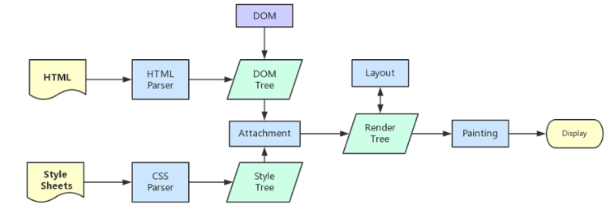

# 浏览器面试考点

## 1 浏览器缓存机制

<https://github.com/ljianshu/Blog/issues/23>

## 2 跨域

### 2.1 同源策略

同源策略是一种约定，它是浏览器最核心也最基本的安全功能，如果缺少了同源策略，浏览器很容易受到XSS、CSRF等攻击。所谓同源是指"协议+域名+端口"三者相同，即便两个不同的域名指向同一个ip地址，也非同源。)
**同源策略限制内容有：**

- Cookie、LocalStorage、IndexedDB 等存储性内容
- DOM 节点
- AJAX 请求发送后，结果被浏览器拦截了

但是有三个标签是允许跨域加载资源：

- ``
- `<link href=XXX>`
- `<script src=XXX>`

### 2.2 jsonp

#### 1) JSONP原理

**利用 `<script>` 标签没有跨域限制的漏洞，网页可以得到从其他来源动态产生的 JSON 数据。JSONP请求一定需要对方的服务器做支持才可以。**

#### 2) JSONP和AJAX对比

JSONP和AJAX相同，都是客户端向服务器端发送请求，从服务器端获取数据的方式。但AJAX属于同源策略，JSONP属于非同源策略（跨域请求）

#### 3) JSONP优缺点

JSONP优点是简单兼容性好，可用于解决主流浏览器的跨域数据访问的问题。**缺点是仅支持get方法具有局限性,不安全可能会遭受XSS攻击。**

#### 4) JSONP的实现流程

- 声明一个回调函数，其函数名(如show)当做参数值，要传递给跨域请求数据的服务器，函数形参为要获取目标数据(服务器返回的data)。
- 创建一个`<script>`标签，把那个跨域的API数据接口地址，赋值给script的src,还要在这个地址中向服务器传递该函数名（可以通过问号传参:?callback=show）。
- 服务器接收到请求后，需要进行特殊的处理：把传递进来的函数名和它需要给你的数据拼接成一个字符串,例如：传递进去的函数名是show，它准备好的数据是`show('我不爱你')`。
- 最后服务器把准备的数据通过HTTP协议返回给客户端，客户端再调用执行之前声明的回调函数（show），对返回的数据进行操作。

在开发中可能会遇到多个 JSONP 请求的回调函数名是相同的，这时候就需要自己封装一个 JSONP函数。

```javascript
// index.html
function jsonp({ url, params, callback }) {
  return new Promise((resolve, reject) => {
    let script = document.createElement('script')
    window[callback] = function(data) {
      resolve(data)
      document.body.removeChild(script)
    }
    params = { ...params, callback } // wd=b&callback=show
    let arrs = []
    for (let key in params) {
      arrs.push(`${key}=${params[key]}`)
    }
    script.src = `${url}?${arrs.join('&')}`
    document.body.appendChild(script)
  })
}
jsonp({
  url: 'http://localhost:3000/say',
  params: { wd: 'Iloveyou' },
  callback: 'show'
}).then(data => {
  console.log(data)
})
```

上面这段代码相当于向`http://localhost:3000/say?wd=Iloveyou&callback=show`这个地址请求数据，然后后台返回`show('我不爱你')`，最后会运行show()这个函数，打印出'我不爱你'

```
// server.js
let express = require('express')
let app = express()
app.get('/say', function(req, res) {
  let { wd, callback } = req.query
  console.log(wd) // Iloveyou
  console.log(callback) // show
  res.end(`${callback}('我不爱你')`)
})
app.listen(3000)
```

### 2.2 CORS跨域资源共享

CORS需要浏览器和服务器同时支持。目前，所有浏览器都支持该功能，IE浏览器不能低于IE10。

实现CORS通信的关键是服务器。只要服务器实现了CORS接口，就可以跨源通信。

浏览器将CORS请求分成两类：简单请求、复杂请求

**1) 简单请求**

只要同时满足以下两大条件，就属于简单请求

条件1：使用下列方法之一：

- GET
- HEAD
- POST

条件2：Content-Type 的值仅限于下列三者之一：

- text/plain
- multipart/form-data
- application/x-www-form-urlencoded

请求中的任意 XMLHttpRequestUpload 对象均没有注册任何事件监听器； XMLHttpRequestUpload 对象可以使用 XMLHttpRequest.upload 属性访问

**对于简单请求，浏览器直接发出CORS请求。具体来说，就是在头信息之中，增加一个`Origin`字段**。

下面是一个例子，浏览器发现这次跨源AJAX请求是简单请求，就自动在头信息之中，添加一个`Origin`字段。

> ```http
> GET /cors HTTP/1.1
> Origin: http://api.bob.com
> Host: api.alice.com
> Accept-Language: en-US
> Connection: keep-alive
> User-Agent: Mozilla/5.0...
> ```

上面的头信息中，`Origin`字段用来说明，本次请求来自哪个源（协议 + 域名 + 端口）。服务器根据这个值，决定是否同意这次请求。

如果`Origin`指定的源，不在许可范围内，服务器会返回一个正常的HTTP回应。浏览器发现，这个回应的头信息没有包含`Access-Control-Allow-Origin`字段（详见下文），就知道出错了，从而抛出一个错误，被`XMLHttpRequest`的`onerror`回调函数捕获。注意，这种错误无法通过状态码识别，因为HTTP回应的状态码有可能是200。

如果`Origin`指定的域名在许可范围内，服务器返回的响应，会多出几个头信息字段。

> ```http
> Access-Control-Allow-Origin: http://api.bob.com
> Access-Control-Allow-Credentials: true
> Access-Control-Expose-Headers: FooBar
> Content-Type: text/html; charset=utf-8
> ```

**2) 复杂请求**

不符合以上条件的请求就肯定是复杂请求了。
复杂请求的CORS请求，会在正式通信之前，增加一次HTTP查询请求，称为"预检"请求,该请求是 option 方法的，通过该请求来知道服务端是否允许跨域请求。

我们用`PUT`向后台请求时，属于复杂请求，后台需做如下配置：

```javascript
// 允许哪个方法访问我
res.setHeader('Access-Control-Allow-Methods', 'PUT')
// 预检的存活时间
res.setHeader('Access-Control-Max-Age', 6)
// OPTIONS请求不做任何处理
if (req.method === 'OPTIONS') {
  res.end() 
}
// 定义后台返回的内容
app.put('/getData', function(req, res) {
  console.log(req.headers)
  res.end('我不爱你')
})
```

接下来我们看下一个完整复杂请求的例子，并且介绍下CORS请求相关的字段

```javascript
// index.html
let xhr = new XMLHttpRequest()
document.cookie = 'name=xiamen' // cookie不能跨域
xhr.withCredentials = true // 前端设置是否带cookie
xhr.open('PUT', 'http://localhost:4000/getData', true)
xhr.setRequestHeader('name', 'xiamen')
xhr.onreadystatechange = function() {
  if (xhr.readyState === 4) {
    if ((xhr.status >= 200 && xhr.status < 300) || xhr.status === 304) {
      console.log(xhr.response)
      //得到响应头，后台需设置Access-Control-Expose-Headers
      console.log(xhr.getResponseHeader('name'))
    }
  }
}
xhr.send()
//server1.js
let express = require('express');
let app = express();
app.use(express.static(__dirname));
app.listen(3000);
//server2.js
let express = require('express')
let app = express()
let whitList = ['http://localhost:3000'] //设置白名单
app.use(function(req, res, next) {
  let origin = req.headers.origin
  if (whitList.includes(origin)) {
    // 设置哪个源可以访问我
    res.setHeader('Access-Control-Allow-Origin', origin)
    // 允许携带哪个头访问我
    res.setHeader('Access-Control-Allow-Headers', 'name')
    // 允许哪个方法访问我
    res.setHeader('Access-Control-Allow-Methods', 'PUT')
    // 允许携带cookie
    res.setHeader('Access-Control-Allow-Credentials', true)
    // 预检的存活时间
    res.setHeader('Access-Control-Max-Age', 6)
    // 允许返回的头
    res.setHeader('Access-Control-Expose-Headers', 'name')
    if (req.method === 'OPTIONS') {
      res.end() // OPTIONS请求不做任何处理
    }
  }
  next()
})
app.put('/getData', function(req, res) {
  console.log(req.headers)
  res.setHeader('name', 'jw') //返回一个响应头，后台需设置
  res.end('我不爱你')
})
app.get('/getData', function(req, res) {
  console.log(req.headers)
  res.end('我不爱你')
})
app.use(express.static(__dirname))
app.listen(4000)
```

上述代码由`http://localhost:3000/index.html`向`http://localhost:4000/`跨域请求，正如我们上面所说的，后端是实现 CORS 通信的关键。

| 字段                             | 内容                                                         |
| -------------------------------- | :----------------------------------------------------------- |
| Access-Control-Allow-Origin      | 指定允许访问的源，即网址，*表示允许所有                      |
| Access-Control-Allow-Credentials | 该字段可选。它的值是一个布尔值，表示是否允许发送Cookie。默认情况下，Cookie不包括在CORS请求之中。设为`true`，即表示服务器明确许可，Cookie可以包含在请求中，一起发给服务器。这个值也只能设为`true`，如果服务器不要浏览器发送Cookie，删除该字段即可。 |
| Access-Control-Request-Method    | 允许CORS请求用到的所有方法                                   |
| Access-Control-Request-Headers   | 该字段是一个逗号分隔的字符串，指定浏览器CORS请求会额外发送的头信息字段 |

**withCredentials** 属性

上面说到，CORS请求默认不发送Cookie和HTTP认证信息。如果要把Cookie发到服务器，一方面要服务器同意，指定`Access-Control-Allow-Credentials`字段。

> ```http
> Access-Control-Allow-Credentials: true
> ```

另一方面，开发者必须在AJAX请求中打开`withCredentials`属性。

> ```javascript
> var xhr = new XMLHttpRequest();
> xhr.withCredentials = true;
> ```

否则，即使服务器同意发送Cookie，浏览器也不会发送。或者，服务器要求设置Cookie，浏览器也不会处理。

但是，如果省略`withCredentials`设置，有的浏览器还是会一起发送Cookie。这时，可以显式关闭`withCredentials`。

> ```javascript
> xhr.withCredentials = false;
> ```

需要注意的是，如果要发送Cookie，`Access-Control-Allow-Origin`就不能设为星号，必须指定明确的、与请求网页一致的域名。同时，Cookie依然遵循同源政策，只有用服务器域名设置的Cookie才会上传，其他域名的Cookie并不会上传，且（跨源）原网页代码中的`document.cookie`也无法读取服务器域名下的Cookie。

## 3 从输入url到页面加载完成的过程

　整个流程如下：

1. 浏览器的地址栏输入URL并按下回车。
2. 浏览器查找当前URL是否存在缓存，并比较缓存是否过期。
3. DNS解析URL对应的IP。
4. 根据IP建立TCP连接（三次握手）。
5. HTTP发起请求。
6. 服务器处理请求，
7. 浏览器接收HTTP响应。
8. 渲染页面，构建DOM树。
9. 关闭TCP连接（四次挥手）。

###3.1 输入URL

### 3.2 查找缓存

说完URL我们说说**浏览器缓存**,HTTP缓存有多种规则，根据是否需要重新向服务器发起请求来分类，我将其分为强制缓存，协商缓存

* **强制缓存**
  * **Expires**是一个绝对时间，即服务器时间。浏览器检查当前时间，如果还没到失效时间就直接使用缓存文件。但是该方法存在一个问题：服务器时间与客户端时间可能不一致。因此该字段已经很少使用，在http1.0中有效。
  * **cache-control**中的max-age保存一个相对时间。例如Cache-Control: max-age = 484200，表示浏览器收到文件后，缓存在484200s内均有效。 如果同时存在cache-control和Expires，浏览器总是优先使用cache-control。

* **协商缓存**
  * **last-modified**是第一次请求资源时，服务器返回的字段，表示最后一次更新的时间。下一次浏览器请求资源时就发送if-modified-since字段。服务器用本地Last-modified时间与if-modified-since时间比较，如果不一致则认为缓存已过期并返回新资源给浏览器；如果时间一致则发送304状态码，让浏览器继续使用缓存
  * **Etag**资源的实体标识（哈希字符串），当资源内容更新时，Etag会改变。服务器会判断Etag是否发生变化，如果变化则返回新资源，否则返回304

#### 缓存机制


### 3.3 DNS解析

域名只是与IP地址的一个映射，查找域名对应的ip地址

1. 浏览器先检查本地hosts文件是否有这个网址映射关系，如果有就调用这个IP地址映射，完成域名解析

2. 如果在本地的 hosts 文件没有能够找到对应的 ip 地址，浏览器会发出一个 DNS请求到本地DNS服务器 。本地DNS服务器一般都是你的网络接入服务器商提供，比如中国电信，中国移动。

3. 查询你输入的网址的DNS请求到达本地DNS服务器之后，本地DNS服务器会首先查询它的缓存记录，如果缓存中有此条记录，就可以直接返回结果，此过程是递归的方式进行查询。如果没有，本地DNS服务器还要向DNS根服务器进行查询。
4. 根DNS服务器没有记录具体的域名和IP地址的对应关系，而是告诉本地DNS服务器，你可以到域服务器上去继续查询，并给出域服务器的地址。这种过程是迭代的过程。　

5. 本地DNS服务器继续向域服务器发出请求，在这个例子中，请求的对象是.com域服务器。.com域服务器收到请求之后，也不会直接返回域名和IP地址的对应关系，而是告诉本地DNS服务器，你的域名的解析服务器的地址。
6. 最后，本地DNS服务器向域名的解析服务器发出请求，这时就能收到一个域名和IP地址对应关系，本地DNS服务器不仅要把IP地址返回给用户电脑，还要把这个对应关系保存在缓存中，以备下次别的用户查询时，可以直接返回结果，加快网络访问。

 **1)什么是DNS？**

　　DNS（Domain Name System，域名系统），因特网上作为域名和[IP地址](http://baike.baidu.com/item/IP%E5%9C%B0%E5%9D%80)相互映射的一个[分布式数据库](http://baike.baidu.com/item/%E5%88%86%E5%B8%83%E5%BC%8F%E6%95%B0%E6%8D%AE%E5%BA%93)，能够使用户更方便的访问[互联网](http://baike.baidu.com/item/%E4%BA%92%E8%81%94%E7%BD%91)，而不用去记住能够被机器直接读取的IP数串。通过[主机](http://baike.baidu.com/item/%E4%B8%BB%E6%9C%BA)名，最终得到该主机名对应的IP地址的过程叫做域名解析（或主机名解析）。

　　通俗的讲，我们更习惯于记住一个网站的名字，比如www.baidu.com,而不是记住它的ip地址，比如：167.23.10.2。而计算机更擅长记住网站的ip地址，而不是像www.baidu.com等链接。因为，DNS就相当于一个电话本，比如你要找www.baidu.com这个域名，那我翻一翻我的电话本，我就知道，哦，它的电话（ip）是167.23.10.2。

 

#### DNS查询的两种方式

**1、递归解析**

​    当局部DNS服务器自己不能回答客户机的DNS查询时，它就需要向其他DNS服务器进行查询。此时有两种方式，如图所示的是递归方式。局部DNS服务器自己负责向其他DNS服务器进行查询，一般是先向该域名的根域服务器查询，再由根域名服务器一级级向下查询。最后得到的查询结果返回给局部DNS服务器，再由局部DNS服务器返回给客户端。


**2、迭代解析**

　　当局部DNS服务器自己不能回答客户机的DNS查询时，也可以通过迭代查询的方式进行解析，如图所示。局部DNS服务器不是自己向其他DNS服务器进行查询，而是把能解析该域名的其他DNS服务器的IP地址返回给客户端DNS程序，客户端DNS程序再继续向这些DNS服务器进行查询，直到得到查询结果为止。也就是说，迭代解析只是帮你找到相关的服务器而已，而不会帮你去查。比如说：baidu.com的服务器ip地址在192.168.4.5这里，你自己去查吧，本人比较忙，只能帮你到这里了。


#### DNS域名称空间的组织方式

 我们在前面有说到根DNS服务器，域DNS服务器，这些都是DNS域名称空间的组织方式。按其功能命名空间中用来描述 DNS 域名称的五个类别的介绍详见下表中，以及与每个名称类型的示例


### 3.4 三次握手

拿到域名对应的IP地址之后，浏览器会以一个随机端口（1024<端口<65535）向服务器的WEB程序（常用的有httpd,nginx等）80端口发起TCP的连接请求`。`这个连接请求到达服务器端后（这中间通过各种路由设备，局域网内除外），进入到网卡，然后是进入到内核的TCP/IP协议栈（用于识别该连接请求，解封包，一层一层的剥开），还有可能要经过Netfilter防火墙（属于内核的模块）的过滤，最终到达WEB程序，最终建立了TCP/IP的连接

* 三次握手过程

  

在通过第一步的DNS域名解析后，获取到了服务器的IP地址，在获取到IP地址后，便会开始建立一次连接，这是由TCP协议完成的，主要通过三次握手进行连接。

　　第一次握手：起初两端都处于CLOSED关闭状态，Client将标志位SYN置为1，随机产生一个值seq=x，并将该数据包发送给Server，Client进入SYN-SENT状态，等待Server确认；

​	第二次握手：Server收到数据包后由标志位SYN=1得知Client请求建立连接，Server将标志位SYN和ACK都置为1，ack=x+1，随机产生一个值seq=y，并将该数据包发送给Client以确认连接请求，Server进入SYN-RCVD状态，此时操作系统为该TCP连接分配TCP缓存和变量；

​	第三次握手：Client收到确认后，检查ack是否为x+1，ACK是否为1，如果正确则将标志位ACK置为1，ack=y+1，并且此时操作系统为该TCP连接分配TCP缓存和变量，并将该数据包发送给Server，Server检查ack是否为y+1，ACK是否为1，如果正确则连接建立成功，Client和Server进入ESTABLISHED状态，完成三次握手，随后Client和Server就可以开始传输数据。

　　完成三次握手，客户端与服务器开始传送数据

* 两次握手行不行
  	我们知道，3次握手完成两个重要的功能，既要双方做好发送数据的准备工作(双方都知道彼此已准备好)，也要允许双方就初始序列号进行协商，这个序列号在握手过程中被发送和确认。

  ​        现在把三次握手改成仅需要两次握手，死锁是可能发生的。作为例子，考虑计算机S和C之间的通信，假定C给S发送一个连接请求分组，S收到了这个分组，并发 送了确认应答分组。按照两次握手的协定，S认为连接已经成功地建立了，可以开始发送数据分组。可是，C在S的应答分组在传输中被丢失的情况下，将不知道S 是否已准备好，不知道S建立什么样的序列号，C甚至怀疑S是否收到自己的连接请求分组。在这种情况下，C认为连接还未建立成功，将忽略S发来的任何数据分 组，只等待连接确认应答分组。而S在发出的分组超时后，重复发送同样的分组。这样就形成了死锁

### 3.5 发起http请求

建立了TCP连接之后，发起一个http请求。一个典型的 http request header 一般需要包括请求的方法，例如 GET 或者 POST 等，不常用的还有 PUT 和 DELETE 、HEAD、OPTION以及 TRACE 方法，一般的浏览器只能发起 GET 或者 POST 请求。

客户端向服务器发起http请求的时候，会有一些请求信息，请求信息包含三个部分：

* 请求行
* 请求头(Request Header)
* 请求正文：


### 3.6 服务器处理请求

​	后端从在固定的端口接收到TCP报文开始，它会对TCP连接进行处理，对HTTP协议进行解析，并按照报文格式进一步封装成HTTP Request对象，供上层使用。

　　一些大一点的网站会将你的请求到反向代理服务器中，因为当网站访问量非常大，网站越来越慢，一台服务器已经不够用了。于是将同一个应用部署在多台服务器上，将大量用户的请求分配给多台机器处理。此时，客户端不是直接通过HTTP协议访问某网站应用服务器，而是先请求到Nginx，Nginx再请求应用服务器，然后将结果返回给客户端，这里Nginx的作用是反向代理服务器。同时也带来了一个好处，其中一台服务器万一挂了，只要还有其他服务器正常运行，就不会影响用户使用。

如图所示：


**反向代理**

客户端本来可以直接通过HTTP协议访问某网站应用服务器，网站管理员可以在中间加上一个Nginx，客户端请求Nginx，Nginx请求应用服务器，然后将结果返回给客户端，此时Nginx就是反向代理服务器。


**正向代理** 

是一个位于客户端和原始服务器(origin server)之间的服务器，为了从原始服务器取得内容，客户端向代理发送一个请求并指定目标(原始服务器)，然后代理向原始服务器转交请求并将获得的内容返回给客户端。客户端必须要进行一些特别的设置才能使用正向代理。

　　**正向代理的用途：**

　　（1）访问原来无法访问的资源，如google

​        （2） 可以做缓存，加速访问资源

　    （3）对客户端访问授权，上网进行认证

　　 （4）代理可以记录用户访问记录（上网行为管理），对外隐藏用户信息

### 3.7 浏览器接受响应

服务器在收到浏览器发送的HTTP请求之后，会将收到的HTTP报文封装成HTTP的Request对象，并通过不同的Web服务器进行处理，处理完的结果以HTTP的Response对象返回，主要包括状态码，响应头，响应报文三个部分。

　　状态码主要包括以下部分

　　1xx：指示信息–表示请求已接收，继续处理。

　　2xx：成功–表示请求已被成功接收、理解、接受。

　　3xx：重定向–要完成请求必须进行更进一步的操作。

　　4xx：客户端错误–请求有语法错误或请求无法实现。

　　5xx：服务器端错误–服务器未能实现合法的请求。

　　响应头主要由Cache-Control、 Connection、Date、Pragma等组成。

　　响应体为服务器返回给浏览器的信息，主要由HTML，css，js，图片文件组成。

### 3.8 浏览器渲染页面

在浏览器还没接收到完整的 `HTML` 文件时，它就开始渲染页面了，在遇到外部链入的脚本标签或样式标签或图片时，会再次发送 `HTTP` 请求重复上述的步骤

浏览器解析渲染页面分为一下五个步骤：

- 根据 HTML 解析出 DOM 树
- 根据 CSS 解析生成 CSS 规则树
- 结合 DOM 树和 CSS 规则树，生成渲染树
- 根据渲染树计算每一个节点的信息
- 根据计算好的信息绘制页面

```

```

**1.根据 HTML 解析 DOM 树**

- 根据 HTML 的内容，将标签按照结构解析成为 DOM 树，DOM 树解析的过程是一个深度优先遍历。即先构建当前节点的所有子节点，再构建下一个兄弟节点。
- 在读取 HTML 文档，构建 DOM 树的过程中，若遇到 script 标签，则 DOM 树的构建会暂停，直至脚本执行完毕。

**2.根据 CSS 解析生成 CSS 规则树**

- 解析 CSS 规则树时 js 执行将暂停，直至 CSS 规则树就绪。
- 浏览器在 CSS 规则树生成之前不会进行渲染。

**3.结合 DOM 树和 CSS 规则树，生成渲染树**

- DOM 树和 CSS 规则树全部准备好了以后，浏览器才会开始构建渲染树。
- 精简 CSS 并可以加快 CSS 规则树的构建，从而加快页面相应速度。

**4.根据渲染树计算每一个节点的信息（布局）**

- 布局：通过渲染树中渲染对象的信息，计算出每一个渲染对象的位置和尺寸
- 回流：在布局完成后，发现了某个部分发生了变化影响了布局，那就需要倒回去重新渲染。

**5.根据计算好的信息绘制页面**

- 绘制阶段，系统会遍历呈现树，并调用呈现器的“paint”方法，将呈现器的内容显示在屏幕上。
- 重绘：某个元素的背景颜色，文字颜色等，不影响元素周围或内部布局的属性，将只会引起浏览器的重绘。
- 回流：某个元素的尺寸发生了变化，则需重新计算渲染树，重新渲染。

### 3.9 断开连接（四次挥手）

**当数据传送完毕，需要断开 tcp 连接，此时发起 tcp 四次挥手**。


- **发起方向被动方发送报文，Fin、Ack、Seq，表示已经没有数据传输了。并进入 FIN_WAIT_1 状态**。(第一次挥手：由浏览器发起的，发送给服务器，我请求报文发送完了，你准备关闭吧)
- **被动方发送报文，Ack、Seq，表示同意关闭请求。此时主机发起方进入 FIN_WAIT_2 状态**。(第二次挥手：由服务器发起的，告诉浏览器，我请求报文接受完了，我准备关闭了，你也准备吧)
- **被动方向发起方发送报文段，Fin、Ack、Seq，请求关闭连接。并进入 LAST_ACK 状态**。(第三次挥手：由服务器发起，告诉浏览器，我响应报文发送完了，你准备关闭吧)
- **发起方向被动方发送报文段，Ack、Seq。然后进入等待 TIME_WAIT 状态。被动方收到发起方的报文段以后关闭连接。发起方等待一定时间未收到回复，则正常关闭**。(第四次挥手：由浏览器发起，告诉服务器，我响应报文接受完了，我准备关闭了，你也准备吧)

## 4 浏览器存储

sessionStorage 和 localStorage 是 HTML5 Web Storage API 提供的，可以方便的在 web 请求之间保存数据。有了本地数据，就可以避免数据在浏览器和服务器间不必要地来回传递。

sessionStorage、 localStorage 、 cookie 都是在浏览器端存储的数据，其中 sessionStorage 的概念很特别，引入了一个“浏览器窗口”的概念。sessionStorage 是在同源的同窗口（或 tab ）中，始终存在的数据。也就是说只要这个浏览器窗口没有关闭，即使刷新页面或进入同源另一页面，数据仍然存在。关闭窗口后， sessionStorage 即被销毁。同时“独立”打开的不同窗口，即使是同一页面， sessionStorage 对象也是不同的

cookies会发送到服务器端。其余两个不会。

Microsoft 指出 Internet Explorer 8 增加 cookie 限制为每个域名 50 个，但 IE7 似乎也允许每个域名 50 个 cookie 。 Firefox 每个域名 cookie 限制为 50 个。 Opera 每个域名 cookie 限制为 30 个。 Firefox 和 Safari 允许 cookie 多达 4097 个字节，包括名（ name ）、值（ value ）和等号。 Opera 许 cookie 多达 4096 个字节，包括：名（ name ）、值（ value ）和等号。 Internet Explorer 允许 cookie 多达 4095 个字节，包括：名（ name ）、值（ value ）和等号。

区别：

- Cookie

  - 每个域名存储量比较小（各浏览器不同，大致 4K ）
  - 所有域名的存储量有限制（各浏览器不同，大致 4K ）
  - 有个数限制（各浏览器不同）
  - 会随请求发送到服务器


- LocalStorage
  - 永久存储
  - 单个域名存储量比较大（推荐 5MB ，各浏览器不同）
  - 总体数量无限制

- SessionStorage
  - 只在 Session 内有效
  - 不同标签页不能进行通信

### 4.1 localStorage

* 保存数据

```
localStorage.setItem(key,value);
```

* 删除数据

```
删除单个数据：localStorage.removeItem(key);
删除所有数据：localStorage.clear();
```

* 读取数据

```
读取数据：localStorage.getItem(key);
```

```
保存对象需要先转成字符串

window.localStorage.setItem('todoList', JSON.stringify(todoList))

读取对象需要将字符串转成对象

JSON.parse(window.localStorage.getItem('todoList'))
```

### 4.2 sessionStorage

api和操作和localStorage一样

### 4.3 cookie

HTTP 很重要的一个特点就是无状态（每一次见面都是“初次见面”），如果单纯的希望通过我们的服务端程序去记
住每一个访问者是不可能的，所以必须借助一些手段或者说技巧让服务端记住客户端，这种手段就是 Cookie 


Cookie 就像是在超级市场买东西拿到的小票，由超市（Server）发给消费者（Browser），超市方面不用记住每
一个消费者的脸，但是他们认识消费者手里的小票（Cookie），可以通过小票知道消费者之前的一些消费信息（在
服务端产生的数据）

#### 4.1 什么是cookie

储存在浏览器的一段字符串（最大5kb）

跨域不共享

每次发送http请求，会将请求域的cookie一起发送给server

server可以修改cookie并返回浏览器,客户端也可以操作cookie

#### 4.2   js操作cookie

```
// 新增一条 cookie，注意：cookie 是有大小限制，约为 4k
// 格式固定：<key>=<value>[; expires=<GMT格式时间>][; path=<作用路径>][; domain=<作用域名>]
// 除了键值以外其余属性均有默认值，可以省略
// expires 表示 cookie 失效的时间，默认为关闭浏览器时
// path 表示 cookie 生效的路径，默认为当路径
// domain 表示 cookie 生效的域名，默认为当前域名
document.cookie = 'name=value; expires=Tue, 10 Oct 2017 16:14:47 GMT; path=/; domain=zce.me'
// 获取全部 cookie
console.log(document.cookie)
// => 'key1=value1; key2=value2'
// 得到的结果是字符串，需要自己通过字符串操作解析
```


#### 4.3 server端操作cookie


#### 4.4 实现登录


## 5 浏览器内核

## 6 浏览器内多个标签页之间的通信

#### 6.1 localstorage

- localstorage是浏览器多个标签共用的存储空间，所以可以用来实现多标签之间的通信(ps：session是会话级的存储空间，每个标签页都是单独的）。
- 直接在window对象上添加监听即可：

```
window.onstorage = (e) => {console.log(e)}
// 或者这样
window.addEventListener('storage', (e) => console.log(e))
复制代码
```

- onstorage以及storage事件，针对都是**非当前页面**对localStorage进行修改时才会触发，当前页面修改localStorage不会触发监听函数。然后就是在对原有的数据的值进行修改时才会触发，比如原本已经有一个key会a值为b的localStorage，你再执行：`localStorage.setItem('a', 'b')`代码，同样是不会触发监听函数的。

#### 6.2 webworker

- 我们都知道JavaScript是**单线程**的，但是浏览器是拥有多个线程的比如：gui渲染线程、JS引擎线程、事件触发线程、异步http请求线程。
- webworker作为浏览器的一个新特性，可以提供一个**额外的线程**来执行一些js代码，并且不会影响到浏览器用户界面。
- 应用场景：比如页面中包含耗时较大的算法代码时，就会阻塞线程影响浏览器渲染等等。这时候就可把耗时代码，放到webworker(另一个线程)中执行。
- 注意，这种多线程能力不是JavaScript语言原生具有的，而是浏览器宿主环境提供的。
- 普通的webworker直接使用`new Worker()`即可创建，这种webworker是**当前页面**专有的。然后还有种共享worker(SharedWorker)，这种是可以多个标签页、iframe共同使用的，接下来介绍如何使用SharedWorker实现标签页之间的通信。

#### 6.3 SharedWorker

- SharedWorker可以被多个window共同使用，但必须保证这些标签页都是同源的(相同的协议，主机和端口号)
- 首先新建一个js文件`worker.js`，具体代码如下：

```javascript
// sharedWorker所要用到的js文件，不必打包到项目中，直接放到服务器即可
let data = ''
onconnect = function (e) {
  let port = e.ports[0]

  port.onmessage = function (e) {
    if (e.data === 'get') {
      port.postMessage(data)
    } else {
      data = e.data
    }
  }
}
复制代码
```

- webworker端(暂且这样称呼)的代码就如上，只需注册一个onmessage监听信息的事件，客户端(即使用sharedWorker的标签页)发送message时就会触发。

- 注意webworker无法在本地使用，出于浏览器本身的安全机制，所以我这次的示例也是放在服务器上的，`worker.js`和`index.html`在同一目录。 

  

  

- 因为客户端和webworker端的通信不像websocket那样是全双工的，所以客户端发送数据和接收数据要分成两步来处理。示例中会有两个按钮，分别对应的向sharedWorker发送数据的请求以及获取数据的请求，但他们本质上都是相同的事件--发送消息。

- webworker端会进行判断，传递的数据为'get'时，就把变量data的值回传给客户端，其他情况，则把客户端传递过来的数据存储到data变量中。下面是客户端的代码：

```javascript
// 这段代码是必须的，打开页面后注册SharedWorker，显示指定worker.port.start()方法建立与worker间的连接
    if (typeof Worker === "undefined") {
      alert('当前浏览器不支持webworker')
    } else {
      let worker = new SharedWorker('worker.js')
      worker.port.addEventListener('message', (e) => {
        console.log('来自worker的数据：', e.data)
      }, false)
      worker.port.start()
      window.worker = worker
    }
// 获取和发送消息都是调用postMessage方法，我这里约定的是传递'get'表示获取数据。
window.worker.port.postMessage('get')
window.worker.port.postMessage('发送信息给worker')
复制代码
```

- 页面A发送数据给worker，然后打开页面B，调用`window.worker.port.postMessage('get')`，即可收到页面A发送给worker的数据。

## 7 Websocket

### 1 WebSocket的作用

初次接触 WebSocket 的人，都会问同样的问题：我们已经有了 HTTP 协议，为什么还需要另一个协议？它能带来什么好处？

答案很简单，因为 HTTP 协议有一个缺陷：通信只能由客户端发起。

举例来说，我们想了解今天的天气，只能是客户端向服务器发出请求，服务器返回查询结果。HTTP 协议做不到服务器主动向客户端推送信息。


这种单向请求的特点，注定了如果服务器有连续的状态变化，客户端要获知就非常麻烦。我们只能使用["轮询"](https://www.pubnub.com/blog/2014-12-01-http-long-polling/)：每隔一段时候，就发出一个询问，了解服务器有没有新的信息。最典型的场景就是聊天室。

轮询的效率低，非常浪费资源（因为必须不停连接，或者 HTTP 连接始终打开）。因此，工程师们一直在思考，有没有更好的方法。WebSocket 就是这样发明的。

### 2 特点

它的最大特点就是，服务器可以主动向客户端推送信息，客户端也可以主动向服务器发送信息，是真正的双向平等对话，属于[服务器推送技术](https://en.wikipedia.org/wiki/Push_technology)的一种。


其他特点包括：

（1）建立在 TCP 协议之上，服务器端的实现比较容易。

（2）与 HTTP 协议有着良好的兼容性。默认端口也是80和443，并且握手阶段采用 HTTP 协议，因此握手时不容易屏蔽，能通过各种 HTTP 代理服务器。

（3）数据格式比较轻量，性能开销小，通信高效。

（4）可以发送文本，也可以发送二进制数据。

（5）没有同源限制，客户端可以与任意服务器通信。

（6）协议标识符是`ws`（如果加密，则为`wss`），服务器网址就是 URL。

## 8 session

由于 Cookie 是服务端下发给客户端由客户端本地保存的。换而言之客户端可以在本地对其随意操作，包括删除和
修改。如果客户端随意伪造一个 Cookie 的话，对于服务端是无法辨别的，就会造成服务端被蒙蔽，构成安全隐
患。于是乎就有了另外一种基于 Cookie 基础之上的手段：Session：

 Session 区别于 Cookie 一个很大的地方就是：Session 数据存在了服务端，而 Cookie 存在了客户端本地，存在服
务端最大的优势就是，不是用户想怎么改就怎么改了。
Session 这种机制会更加适合于存放一些属于用户而又不能让用户修改的数据，因为客户端不再保存具体的数据，
只是保存一把“钥匙”，伪造一把可以用的钥匙，可能性是极低的，所以不需要在意。 


## 9 安全

### 9.1 xss攻击

XSS (Cross-Site Scripting)，跨站脚本攻击，因为缩写和 CSS重叠，所以只能叫 XSS。跨站脚本攻击是指通过存在安全漏洞的Web网站注册用户的浏览器内运行非法的HTML标签或JavaScript进行的一种攻击。

跨站脚本攻击有可能造成以下影响:

- 利用虚假输入表单骗取用户个人信息。
- 利用脚本窃取用户的Cookie值，被害者在不知情的情况下，帮助攻击者发送恶意请求。
- 显示伪造的文章或图片。

**XSS 的原理是恶意攻击者往 Web 页面里插入恶意可执行网页脚本代码，当用户浏览该页之时，嵌入其中 Web 里面的脚本代码会被执行，从而可以达到攻击者盗取用户信息或其他侵犯用户安全隐私的目的**。

#### 存储型 XSS

持久型 XSS 漏洞，一般存在于 Form 表单提交等交互功能，如文章留言，提交文本信息等，黑客利用的 XSS 漏洞，将内容经正常功能提交进入数据库持久保存，当前端页面获得后端从数据库中读出的注入代码时，恰好将其渲染执行。

主要注入页面方式和非持久型 XSS 漏洞类似，只不过持久型的不是来源于 URL，referer，forms 等，而是来源于**后端从数据库中读出来的数据** 。持久型 XSS 攻击不需要诱骗点击，黑客只需要在提交表单的地方完成注入即可，但是这种 XSS 攻击的成本相对还是很高。

攻击成功需要同时满足以下几个条件：

- POST 请求提交表单后端没做转义直接入库。
- 后端从数据库中取出数据没做转义直接输出给前端。
- 前端拿到后端数据没做转义直接渲染成 DOM。

持久型 XSS 有以下几个特点：

- 持久性，植入在数据库中
- 盗取用户敏感私密信息
- 危害面广

实际场景：

攻击者写一篇包含恶意javascript代码的博客文章，文章发表后，所有访问该博客文章的用户，都会在他们的浏览器中执行这段恶意的代码。黑客把恶意的代码保存在服务端

#### 反射型 XSS

反射型 XSS 的攻击步骤：

1.攻击者构造出特殊的 URL，其中包含恶意代码。

2.用户打开带有恶意代码的 URL 时，网站服务端将恶意代码从 URL 中取出，拼接在 HTML 中返回给浏览器。

3.用户浏览器接收到响应后解析执行，混在其中的恶意代码也被执行。

4.恶意代码窃取用户数据并发送到攻击者的网站，或者冒充用户的行为，调用目标网站接口执行攻击者指定的操作。

反射型 XSS 跟存储型 XSS 的区别是：存储型 XSS 的恶意代码存在数据库里，反射型 XSS 的恶意代码存在 URL 里。

反射型 XSS 漏洞常见于通过 URL 传递参数的功能，如网站搜索、跳转等。

由于需要用户主动打开恶意的 URL 才能生效，攻击者往往会结合多种手段诱导用户点击。

POST 的内容也可以触发反射型 XSS，只不过其触发条件比较苛刻（需要构造表单提交页面，并引导用户点击），所以非常少见。

**预防**

1.改成纯前端渲染，把代码和数据分隔开。

2.用户的输入永远不可信任的，最普遍的做法就是转义输入输出的内容，对于引号、尖括号、斜杠进行转义

3 设置HttpOnly cookie

这是预防XSS攻击窃取用户cookie最有效的防御手段。Web应用程序在设置cookie时，将其属性设为HttpOnly，就可以避免该网页的cookie被客户端恶意JavaScript窃取，保护用户cookie信息。

### 9.2 SQL注入

### 9.3 CSRF

CSRF(Cross Site Request Forgery)，即跨站请求伪造，是一种常见的Web攻击，它利用用户已登录的身份，在用户毫不知情的情况下，以用户的名义完成非法操作。

#### 1.CSRF攻击的原理

下面先介绍一下CSRF攻击的原理：

[](https://camo.githubusercontent.com/a24b3da2f84bbf939f49451010bcfb8292423a6b/68747470733a2f2f757365722d676f6c642d63646e2e786974752e696f2f323031392f312f32342f313638383033306132343730323330313f773d34333226683d33303326663d706e6726733d3434343837)

完成 CSRF 攻击必须要有三个条件：

- 用户已经登录了站点 A，并在本地记录了 cookie
- 在用户没有登出站点 A 的情况下（也就是 cookie 生效的情况下），访问了恶意攻击者提供的引诱危险站点 B (B 站点要求访问站点A)。
- 站点 A 没有做任何 CSRF 防御

我们来看一个例子： 当我们登入转账页面后，突然眼前一亮**惊现"XXX隐私照片，不看后悔一辈子"的链接**，耐不住内心躁动，立马点击了该危险的网站（页面代码如下图所示），但当这页面一加载，便会执行`submitForm`这个方法来提交转账请求，从而将10块转给黑客。

[](https://camo.githubusercontent.com/7317352e98d750b1f34cea28a8849e00f8c2d869/68747470733a2f2f757365722d676f6c642d63646e2e786974752e696f2f323031392f312f32342f313638383034316662376662636461333f773d35343826683d33383826663d706e6726733d323337313630)

#### 2.如何防御

防范 CSRF 攻击可以遵循以下几种规则：

- Get 请求不对数据进行修改
- 不让第三方网站访问到用户 Cookie
- 阻止第三方网站请求接口
- 请求时附带验证信息，比如验证码或者 Token

##### 1) SameSite

可以对 Cookie 设置 SameSite 属性。该属性表示 Cookie 不随着跨域请求发送，可以很大程度减少 CSRF 的攻击，但是该属性目前并不是所有浏览器都兼容。

##### 2) Referer Check

HTTP Referer是header的一部分，当浏览器向web服务器发送请求时，一般会带上Referer信息告诉服务器是从哪个页面链接过来的，服务器籍此可以获得一些信息用于处理。可以通过检查请求的来源来防御CSRF攻击。正常请求的referer具有一定规律，如在提交表单的referer必定是在该页面发起的请求。所以**通过检查http包头referer的值是不是这个页面，来判断是不是CSRF攻击**。

但在某些情况下如从https跳转到http，浏览器处于安全考虑，不会发送referer，服务器就无法进行check了。若与该网站同域的其他网站有XSS漏洞，那么攻击者可以在其他网站注入恶意脚本，受害者进入了此类同域的网址，也会遭受攻击。出于以上原因，无法完全依赖Referer Check作为防御CSRF的主要手段。但是可以通过Referer Check来监控CSRF攻击的发生。

##### 3) Anti CSRF Token

目前比较完善的解决方案是加入Anti-CSRF-Token。即发送请求时在HTTP 请求中以参数的形式加入一个随机产生的token，并在服务器建立一个拦截器来验证这个token。服务器读取浏览器当前域cookie中这个token值，会进行校验该请求当中的token和cookie当中的token值是否都存在且相等，才认为这是合法的请求。否则认为这次请求是违法的，拒绝该次服务。

**这种方法相比Referer检查要安全很多**，token可以在用户登陆后产生并放于session或cookie中，然后在每次请求时服务器把token从session或cookie中拿出，与本次请求中的token 进行比对。由于token的存在，攻击者无法再构造出一个完整的URL实施CSRF攻击。但在处理多个页面共存问题时，当某个页面消耗掉token后，其他页面的表单保存的还是被消耗掉的那个token，其他页面的表单提交时会出现token错误。

##### 4) 验证码

应用程序和用户进行交互过程中，特别是账户交易这种核心步骤，强制用户输入验证码，才能完成最终请求。在通常情况下，验证码够很好地遏制CSRF攻击。**但增加验证码降低了用户的体验，网站不能给所有的操作都加上验证码**。所以只能将验证码作为一种辅助手段，在关键业务点设置验证码。

